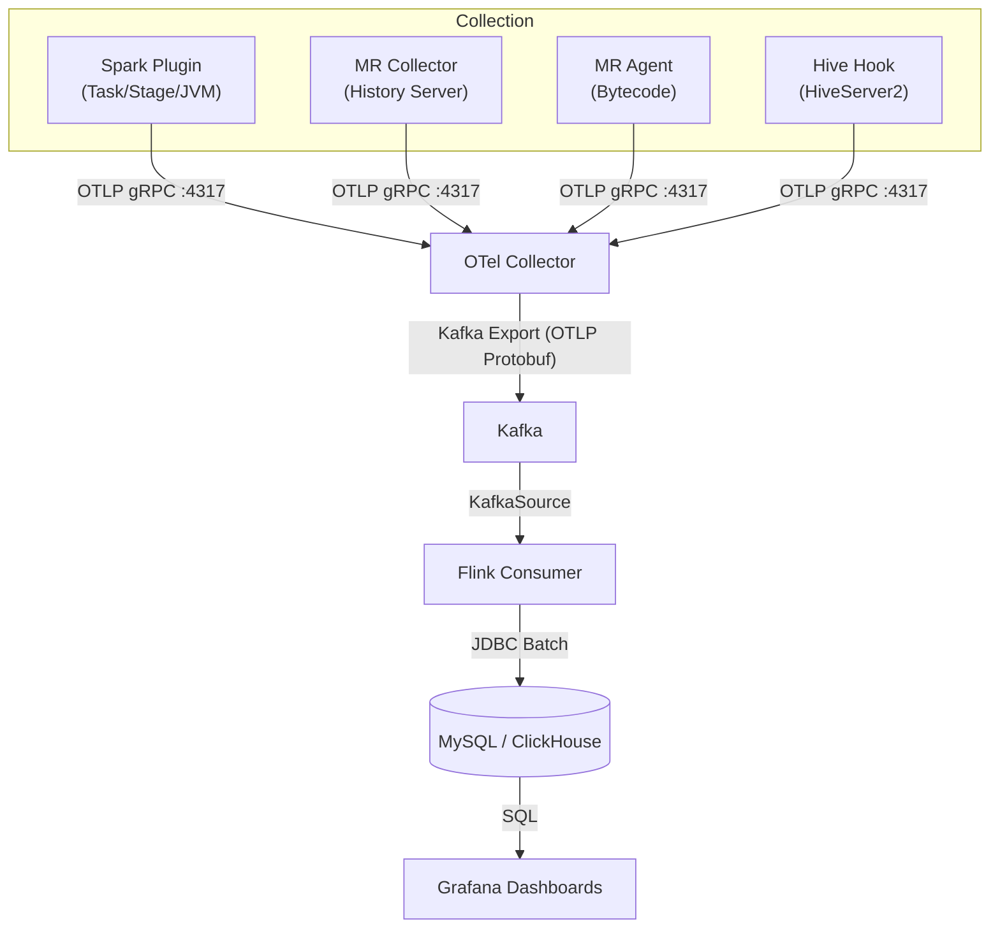

# Hadoop Telemetry Stack

A transparent observability solution for big data workloads. Capture Spark / MapReduce / Hive metrics via OpenTelemetry, stream through Kafka to MySQL or ClickHouse, and visualize everything in Grafana.



**Key package**: `x.mg.metrics` | **Build tool**: Maven multi-module with Spark version profiles

## Supported Versions

| Spark | Scala | Profile | Mechanism |
|-------|-------|---------|-----------|
| 2.4.x | 2.11 | `spark-2` | `spark.extraListeners` |
| 3.0 - 3.5.x | 2.12 | `spark-3` (default) | `SparkPlugin` API |
| 4.0.x | 2.13 | `spark-4` | `SparkPlugin` API |

Also compatible with Hadoop 2.7+ / 3.x, Hive 2.3+ / 3.x, and Flink 1.18.

## Quick Build

```bash
# Omnipackage (single JAR supports Spark 2/3/4 + MR Agent/Collector + Hive Hook)
chmod +x build-omni.sh && ./build-omni.sh

# Or build per version
mvn clean package -DskipTests              # Spark 3.x (default)
mvn clean package -Pspark-2 -DskipTests    # Spark 2.x
mvn clean package -Pspark-4 -DskipTests    # Spark 4.x
```

## Quick Deploy

```bash
# Install omnipackage to Spark / Hive / MR
./deploy/install-omni.sh \
  --spark-home=/opt/spark --hive-home=/opt/hive --hadoop-home=/opt/hadoop \
  --otel-endpoint=http://otel-collector:4317 -y

# Import Grafana dashboards
./deploy/deploy-grafana.sh \
  --grafana-url=http://grafana:3000 --user=admin --password=admin
```

## How It Works

The stack collects metrics at four integration points:

| Component | Mechanism | Metrics |
|-----------|-----------|---------|
| **Spark Plugin** | `SparkPlugin` API or `spark.extraListeners` | Task/stage IO, shuffle, execution time, JVM heap/GC, SQL query metrics |
| **MR Collector** | Standalone Java app polling History Server REST API | Job-level HDFS IO, CPU, GC, maps/reduces |
| **MR Agent** | Java Agent via ByteBuddy bytecode instrumentation | Task-level map/reduce input/output records, shuffle bytes |
| **Hive Hook** | `ExecuteWithHookContext` post-execution hook | Query duration, input/output bytes/rows, table lineage |

All exporters use OTLP gRPC with **DELTA temporality** to prevent duplicate data. Metrics flow through an OTel Collector to Kafka, where a Flink DataStream job consumes and writes them to MySQL or ClickHouse. Grafana dashboards provide the visualization layer.

## Documentation

| Doc | Description |
|-----|-------------|
| [Quick Start](docs/quickstart.md) | Build through verification, end-to-end |
| [Architecture](docs/architecture.md) | Module structure, data flow, design decisions |
| [Deployment Guide](docs/deployment-guide.md) | Configuration parameters, metric reference, troubleshooting |
| [Spark Plugin](docs/spark-plugin.md) | Spark plugin configuration and metric reference |
| [MR Telemetry](docs/mr-telemetry.md) | MR Collector / Agent configuration and metric reference |
| [Flink Consumer](docs/flink-consumer.md) | Flink Consumer configuration and database schema |
| [Release Guide](docs/release.md) | Version bump, tagging, artifact deployment |

## Key Design Principles

- **Never blocks user tasks**: All telemetry failures are isolated via try-catch; initialization failures produce no-op instances, not crashes
- **DELTA aggregation**: Prevents metric duplication on re-export
- **Three-tier config merge**: Spark conf overrides > HOCON file > built-in defaults
- **Shaded fat JARs**: All OTel/gRPC/Protobuf dependencies relocated to `x.mg.metrics.shaded.*` -- zero classpath conflicts
- **Runtime version detection**: Omnipackage probes Spark version at runtime via `Class.forName` -- no separate JARs needed

## Grafana Dashboards

13 pre-built dashboards are available in `deploy/grafana/`, covering platform overview, per-engine metrics, performance analysis, cost attribution, capacity planning, and IO analysis. Six dashboards use engine-specific tables; seven cross-engine analysis dashboards use the `metric_events` unified wide table.

## Performance

Benchmarked with Intel HiBench (small profile) on 4C8G single-node with Spark 3.2.0 + Hadoop 3.2.0:
- Average overhead across 10 workloads: approximately -1.3% (within measurement noise)
- Hive hook overhead: <2%
- MR Agent: verified metrics arrive at MySQL for all workloads

## License

[Apache License 2.0](LICENSE)
