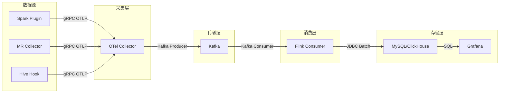

# 架构设计

## 整体架构



## 模块结构

```
spark/
├── spark-telemetry-common/           # Java-only core: config, models, OTel SDK setup, lifecycle
├── spark-telemetry-adapter-spark2/   # Scala 2.11 adapter for Spark 2.4
├── spark-telemetry-adapter-spark30/  # Scala 2.12 adapter for Spark 3.0
├── spark-telemetry-adapter-spark32/  # Scala 2.12 adapter for Spark 3.2
├── spark-telemetry-adapter-spark3/   # Scala 2.12 adapter for Spark 3.5
├── spark-telemetry-adapter-spark4/   # Scala 2.13 adapter for Spark 4.0
├── spark-telemetry-dist-spark{2,3,4}/ # Shaded fat JARs for each Spark version
├── spark-telemetry-omni-facade/      # Pure Java facade for omnipackage
├── spark-telemetry-adapters-relocated/ # Relocates adapters to v2/v3/v4 packages
└── spark-telemetry-dist-omni/        # Unified distribution: Spark 2/3/4 + MR in one JAR
mapreduce-collector/
├── mr-telemetry-collector/           # Standalone MR job metric collector
└── mr-telemetry-dist/
mapreduce-agent/
├── mr-telemetry-agent/              # MR task-level agent via ByteBuddy
└── mr-telemetry-agent-dist/
hive/
├── hive-telemetry-hook/             # Hive query telemetry hook
└── hive-telemetry-hook-dist/
flink/
├── metrics-flink-consumer/          # Kafka → MySQL/ClickHouse
└── metrics-flink-consumer-dist/
diagnostic/
└── diagnostic-core/                  # 诊断工具
```

## 数据流

### Spark Plugin

1. **SparkTelemetryPlugin** loaded via `spark.plugins` config
2. **TelemetryDriverPlugin** initializes `TelemetryLifecycle` singleton and registers `SparkTelemetryListener`
3. **TelemetryExecutorPlugin** initializes `TelemetryLifecycle` + `SparkTelemetryMetricsSink` for JVM metrics
4. **SparkTelemetryListener** captures `onTaskEnd`/`onStageCompleted` events
5. **TelemetryLifecycle.accept()** routes events to **MetricRecorder**
6. **MetricRecorder** records OTel counters/histograms
7. **OtelRegistry** manages: PeriodicMetricReader → OTLP gRPC exporter (DELTA temporality) → OTel Collector

### Omnipackage 架构

Omnipackage 在单个 JAR 中支持 Spark 2/3/4，运行时自动检测版本：

1. 每个 adapter 通过 shade 重定位到 `x.mg.metrics.sparktelemetry.adapter.internal.v{2,3,4}`
2. Pure Java facade 通过反射委托给版本特定的 adapter
3. 版本检测使用 `Class.forName` 探测 Spark/Scala 类

## 关键设计决策

| 决策 | 原因 |
|------|------|
| DELTA Temporality | 防止 re-export 时重复数据 |
| Async Flush | 避免 DAGScheduler 线程阻塞 |
| appId Fallback | 处理 local mode 和短生命周期应用 |
| MR Gauge→Counter | 避免 `buildWithCallback` 内存泄漏 |
| SQL Text LRU Cache | 防止内存泄漏，max 1000 entries |
