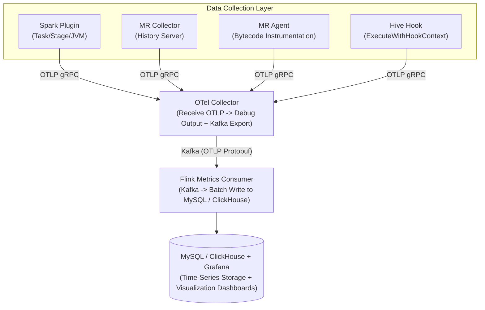

# Spark Telemetry Listener — Deployment Guide

## Product Overview

Spark Telemetry Listener is a transparent Spark / MapReduce observability solution that exports IO, CPU, GC, and other metrics from big data tasks to an OTel Collector via the OpenTelemetry protocol, persists them to MySQL or ClickHouse through Kafka, and ultimately visualizes them in Grafana.

### Core Components

| Component | Type | Description | Deployment Docs |
|-----------|------|-------------|----------------|
| **Spark Telemetry Plugin** | Spark Plugin | Captures Spark task/stage IO metrics and JVM system metrics | [Spark Plugin](spark-plugin.md) |
| **MR Telemetry Collector** | Standalone Java app | Polls Hadoop History Server REST API for MR job metrics | [MR Telemetry](mr-telemetry.md) |
| **MR Telemetry Agent** | Java Agent | Byte-buddy instrumentation for real-time MR task-level metrics | [MR Telemetry](mr-telemetry.md) |
| **Hive Telemetry Hook** | Hive Hook | Captures HiveServer2 query metrics (supports MR and Spark engines) | [Hive Hook](hive-hook.md) |
| **Flink Metrics Consumer** | Flink Job | Consumes OTLP metrics from Kafka and writes to MySQL / ClickHouse | [Flink Consumer](flink-consumer.md) |
| **Diagnostic Tool** | Interactive CLI | Checks backend component (OTel/Kafka/MySQL/Grafana) health and application configuration correctness | [Diagnostic Tool](diagnostic.md) |

### Supported Spark Versions

| Spark Version | Scala Version | Maven Profile | Plugin Loading Mechanism |
|---------------|---------------|---------------|--------------------------|
| Spark 2.4.x | 2.11 | `spark-2` | `spark.extraListeners` |
| Spark 3.2.x | 2.12 | `spark-32` | `SparkPlugin` API |
| Spark 3.5.x | 2.12 | `spark-3` (default) | `SparkPlugin` API |
| Spark 4.0.x | 2.13 | `spark-4` | `SparkPlugin` API |

---

## System Architecture



---

## Build

### Prerequisites

- JDK 8 (Spark 2/3) or JDK 17+ (Spark 4)
- Maven 3.6+

### Build Commands

```bash
# Build Spark 3.x version (default)
mvn clean package -DskipTests

# Build Spark 2.x version
mvn clean package -Pspark-2 -DskipTests

# Build Spark 4.x version (requires JDK 17+)
mvn clean package -Pspark-4 -DskipTests

# Build Omnipackage (unified JAR: Spark 2/3/4 + MR Collector + MR Agent + Hive Hook)
chmod +x build-omni.sh && ./build-omni.sh

# Build Flink Consumer
mvn clean package -pl flink/metrics-flink-consumer,flink/metrics-flink-consumer-dist -am -DskipTests

# Build Diagnostic Tool
mvn clean package -pl diagnostic/diagnostic-core -am -DskipTests
```

### Build Artifacts

| Artifact | Path | Description |
|----------|------|-------------|
| Spark 2 Plugin | `spark/spark-telemetry-dist-spark2/target/*.jar` | Self-contained Shaded JAR |
| Spark 3 Plugin | `spark/spark-telemetry-dist-spark3/target/*.jar` | Self-contained Shaded JAR |
| Spark 3.2 Plugin | `spark/spark-telemetry-dist-spark32/target/*.jar` | Spark 3.2.x specific adapter |
| Spark 4 Plugin | `spark/spark-telemetry-dist-spark4/target/*.jar` | Self-contained Shaded JAR |
| **Omnipackage** | `spark/spark-telemetry-dist-omni/target/*.jar` | **Unified JAR (Spark 2/3/4 + MR Collector + MR Agent + Hive Hook)** |
| MR Collector | `mapreduce-collector/mr-telemetry-dist/target/*.jar` | Self-contained Shaded JAR |
| MR Agent | `mapreduce-agent/mr-telemetry-agent-dist/target/*.jar` | Java Agent JAR |
| Flink Consumer | `flink/metrics-flink-consumer-dist/target/*.jar` | Self-contained Shaded JAR |
| Diagnostic Tool | `diagnostic/diagnostic-core/target/*.jar` | Interactive diagnostic tool (JLine CLI) |

All distribution JARs are built using `maven-shade-plugin`; OTel, gRPC, Protobuf, and other dependencies are relocated to the `x.mg.metrics.shaded.*` namespace to avoid conflicts with the host environment.

### Omnipackage Build Verification

```bash
# Check the artifact
ls -lh spark/spark-telemetry-dist-omni/target/spark-telemetry-dist-omni-*.jar

# Verify relocated adapters
jar tf spark/spark-telemetry-dist-omni/target/*.jar | grep "adapter/internal"

# Verify no unshaded OTel classes
jar tf spark/spark-telemetry-dist-omni/target/*.jar | grep "^io/opentelemetry/"
# Should be empty
```

---

## One-Click Deployment Scripts

After building, use the deployment scripts to install the Omnipackage into the Spark / Hive / MR environment and import Grafana dashboards into your Grafana instance.

### Omnipackage Installation Script

`deploy/install-omni.sh` copies the Omnipackage JAR into each component's classpath directory and generates the corresponding configuration files. It supports repeated runs and automatically replaces old JAR versions.

**Installation Paths:**

| Component | JAR Installation Path |
|-----------|----------------------|
| Spark | `$SPARK_HOME/jars/spark-telemetry-omni.jar` |
| Hive | `$HIVE_HOME/lib/spark-telemetry-omni.jar` |
| MR Collector | `$HADOOP_HOME/share/hadoop/mapreduce-telemetry/spark-telemetry-omni.jar` |

**Usage:**

```bash
# Basic install (specify component directories and OTel Collector address)
./deploy/install-omni.sh \
  --spark-home=/opt/spark \
  --hive-home=/opt/hive \
  --hadoop-home=/opt/hadoop \
  --otel-endpoint=http://otel-collector:4317 \
  -y

# Install only Spark and Hive, skip MR Collector
./deploy/install-omni.sh \
  --spark-home=/opt/spark \
  --hive-home=/opt/hive \
  --skip-mr -y

# Spark 2.x environment (uses extraListeners instead of SparkPlugin API)
./deploy/install-omni.sh \
  --spark2 \
  --spark-home=/opt/spark-2.4 \
  --hadoop-home=/opt/hadoop \
  --otel-endpoint=http://otel-collector:4317 \
  -y

# Dry-run mode (shows what will be done without executing)
./deploy/install-omni.sh \
  --dry-run \
  --spark-home=/opt/spark \
  --hive-home=/opt/hive \
  --hadoop-home=/opt/hadoop

# Backup old JAR before replacing
./deploy/install-omni.sh \
  --backup \
  --spark-home=/opt/spark \
  --hive-home=/opt/hive \
  -y
```

**Parameters:**

| Parameter | Default | Description |
|-----------|---------|-------------|
| `--spark-home` | `$SPARK_HOME` | Spark installation directory |
| `--hadoop-home` | `$HADOOP_HOME` | Hadoop installation directory |
| `--hive-home` | `$HIVE_HOME` | Hive installation directory |
| `--otel-endpoint` | `http://localhost:4317` | OTel Collector gRPC endpoint |
| `--spark-service` | `spark-application` | Spark OTel service name |
| `--hive-service` | `hive-server2` | Hive OTel service name |
| `--mr-service` | `mr-telemetry-collector` | MR Collector OTel service name |
| `--mr-history-url` | `http://localhost:19888` | MR History Server URL |
| `--config-dir` | `./telemetry-configs` | Output directory for generated config files |
| `--skip-spark` | - | Skip Spark installation |
| `--skip-mr` | - | Skip MR Collector installation |
| `--skip-hive` | - | Skip Hive installation |
| `--spark2` | - | Use Spark 2.x configuration (extraListeners) |
| `--backup` | - | Backup old JAR before replacing |
| `--dry-run` | - | Preview only, no execution |
| `-y` / `--yes` | - | Skip confirmation prompts |

**Generated Configuration Files:**

The script generates the following files in the directory specified by `--config-dir`:

| File | Description |
|------|-------------|
| `spark-telemetry.conf` | Spark Plugin HOCON configuration |
| `spark-telemetry.conf.snippet` | Config snippet to add to `spark-defaults.conf` |
| `hive-telemetry.conf` | Hive Hook HOCON configuration |
| `hive-telemetry-site.xml.snippet` | Config snippet to add to `hive-site.xml` |
| `mr-collector.conf` | MR Collector HOCON configuration |
| `start-mr-collector.sh` | MR Collector startup script |
| `mr-telemetry-collector.service` | systemd service file (optional) |
| `INSTALL_SUMMARY.txt` | Installation summary |

After installation, follow the prompts to add the configuration snippets to the corresponding configuration files and restart services.

### Grafana Dashboard Deployment Script

`deploy/deploy-grafana.sh` bulk-imports all dashboard JSON files from `deploy/grafana/` into a Grafana instance using username/password authentication. It supports repeated runs and automatically overwrites existing dashboards.

**Usage:**

```bash
# Deploy all dashboards to Grafana
./deploy/deploy-grafana.sh \
  --grafana-url=http://grafana:3000 \
  --user=admin \
  --password=admin

# Specify target folder name
./deploy/deploy-grafana.sh \
  --grafana-url=http://grafana:3000 \
  --user=admin \
  --password=secret \
  --folder=Production

# Dry-run mode (no actual upload)
./deploy/deploy-grafana.sh \
  --grafana-url=http://grafana:3000 \
  --user=admin \
  --password=admin \
  --dry-run
```

**Parameters:**

| Parameter | Default | Description |
|-----------|---------|-------------|
| `--grafana-url` | (required) | Grafana base URL |
| `--user` | (required) | Grafana admin username |
| `--password` | (required) | Grafana admin password |
| `--folder` | `Telemetry` | Target folder name in Grafana |
| `--dashboard-dir` | `deploy/grafana` | Dashboard JSON file directory |
| `--dry-run` | - | Preview only, no upload |

**Prerequisites:** `curl`, `python3`

The script automatically creates the target folder in Grafana if it does not exist, then uploads each `.json` file from `deploy/grafana/` one by one. Each run overwrites existing dashboards, making it suitable for CI/CD integration.

---

## OTel Collector Configuration

### Minimal Configuration

Create `config.yaml`:

```yaml
extensions:
  health_check:
    endpoint: 0.0.0.0:13133

receivers:
  otlp:
    protocols:
      grpc:
        endpoint: 0.0.0.0:4317
      http:
        endpoint: 0.0.0.0:4318

exporters:
  debug:
    verbosity: detailed
  kafka:
    topic: telemetry-metrics
    encoding: otlp_proto
    brokers:
      - kafka:9092
    producer:
      compression: snappy
      max_message_bytes: 1000000

service:
  extensions: [health_check]
  pipelines:
    metrics:
      receivers: [otlp]
      exporters: [debug, kafka]
```

### Running

```bash
docker run -d --name otel-collector \
  -v $(pwd)/config.yaml:/etc/otelcol-contrib/config.yaml \
  -p 4317:4317 -p 4318:4318 -p 13133:13133 \
  otel/opentelemetry-collector-contrib:0.96.0 \
  --config=/etc/otelcol-contrib/config.yaml
```

> **Important**: You must use the `otel/opentelemetry-collector-contrib` image (not the core image), as the core image does not include the Kafka exporter. The configuration must include the `health_check` extension, otherwise K8s deployments with probes will enter CrashLoopBackOff.

---

## Common Issues and Troubleshooting

### Q1: Spark plugin not working, no metrics output

1. Verify the JAR path is correct and accessible
2. Check the `spark.plugins` (Spark 3/4) or `spark.extraListeners` (Spark 2) configuration
3. Check Driver/Executor logs for `TelemetryLifecycle initialized`
4. Verify the OTel Collector address is reachable
5. Check that config keys include the `.otel.` segment (common mistake)

### Q2: Short-running job metrics missing

The plugin triggers `flushAsync()` non-blocking flush automatically in `onJobEnd` and calls `forceFlush()` synchronously on shutdown. If data is still missing, reduce the export interval: `spark.telemetry.otel.export.interval.ms=5000`.

### Q3: MR Collector connection timeout to History Server

1. Verify the URL and port (History Server port is 19888 for both Hadoop 2.x and 3.x)
2. Increase timeouts: `connect.timeout.secs` / `read.timeout.secs`

### Q4: OTel Collector fails to start

1. Use `otel/opentelemetry-collector-contrib` (not the core image)
2. The configuration must include the `health_check` extension
3. Specify the config file via the `--config` parameter

### Q5: No metrics data visible in Kafka

1. Check OTel Collector logs: `kubectl logs -l app=otel-collector`
2. Verify the Kafka exporter configuration (broker addresses, topic)
3. Use `kafka-dump-log.sh --files <log-file>` to verify messages exist
4. Note: `kafka-console-consumer.sh` may time out in single-node KRaft mode

### Q6: Omnipackage version detection error

1. Check the version detected by `OmniContext` in Driver/Executor logs
2. Verify there are no conflicting `scala-library` JARs on the classpath
3. If using a custom classpath, ensure `scala-library` matches the Spark version

### Q7: Omnipackage build fails (adapters-relocated not found)

The `adapters-relocated` module is only activated under the `omni` profile. Use the `./build-omni.sh` script to build; do not build this module individually.

---

## Appendix: Version Compatibility Matrix

| Component | Minimum Version | Recommended Version | Notes |
|-----------|---------------|---------------------|-------|
| Spark (Plugin) | 2.4.x | 3.5.x | Spark 2 uses listener approach, 3/4 uses Plugin API |
| Hadoop (MR Collector) | 2.7.0 | 3.4.3 | Collector uses History Server REST API |
| Hadoop (MR Agent) | 2.x / 3.x | 3.x | Agent uses `mapreduce.*.java.opts` |
| Java | 8 | 8 | Spark 4 requires JDK 17+ |
| OTel Collector | 0.96+ | 0.96.0 (Contrib) | Must use Contrib version |
| Kafka | 3.7+ | 3.7.0 | Supports KRaft mode |
| Flink | 1.18 | 1.18.0 | Last version supporting Java 8 |
| MySQL | 8.0 | 8.0 | Flink Consumer Sink |
| ClickHouse | 23.8 | 23.8 | Flink Consumer Sink |

## Appendix: Port Reference

| Service | Port | Protocol | Description |
|---------|------|----------|-------------|
| OTel Collector (gRPC) | 4317 | gRPC | OTLP receive |
| OTel Collector (HTTP) | 4318 | HTTP | OTLP receive |
| OTel Collector (Health) | 13133 | HTTP | Health check |
| Kafka Broker | 9092 | TCP | Kafka client |
| Kafka Controller | 9093 | TCP | KRaft controller |
| History Server (Hadoop 3) | 19888 | HTTP | MR job history |
| HDFS NN Web (Hadoop 3) | 9870 | HTTP | NameNode Web UI |
| HDFS NN Web (Hadoop 2) | 50070 | HTTP | NameNode Web UI |
| MySQL | 3306 | TCP | MySQL protocol |
| ClickHouse HTTP | 8123 | HTTP | ClickHouse HTTP interface |
| Grafana | 3000 | HTTP | Grafana Web UI |
