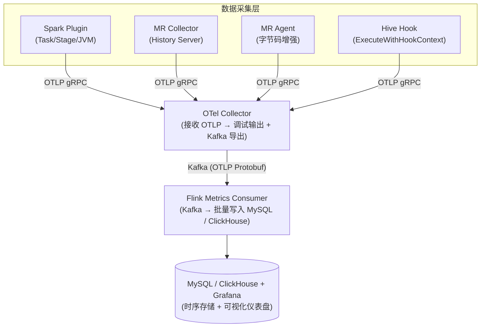

# Spark Telemetry Listener — 部署指南

## 产品概述

Spark Telemetry Listener 是一套透明的 Spark / MapReduce 可观测性方案，通过 OpenTelemetry 协议将大数据任务的 IO、CPU、GC 等指标导出到 OTel Collector，再经由 Kafka 持久化到 MySQL 或 ClickHouse，最终通过 Grafana 进行可视化。

### 核心组件

| 组件 | 类型 | 说明 | 部署文档 |
|------|------|------|---------|
| **Spark Telemetry Plugin** | Spark 插件 | 捕获 Spark 任务/阶段 IO 指标及 JVM 系统指标 | [Spark Plugin](spark-plugin.md) |
| **MR Telemetry Collector** | 独立 Java 应用 | 轮询 Hadoop History Server REST API 采集 MR 作业指标 | [MR Telemetry](mr-telemetry.md) |
| **MR Telemetry Agent** | Java Agent | 字节码增强方式实时采集 MR 任务级指标 | [MR Telemetry](mr-telemetry.md) |
| **Hive Telemetry Hook** | Hive Hook | 捕获 HiveServer2 查询指标（支持 MR 和 Spark 引擎） | [Hive Hook](hive-hook.md) |
| **Flink Metrics Consumer** | Flink 作业 | 消费 Kafka 中的 OTLP 指标写入 MySQL / ClickHouse | [Flink Consumer](flink-consumer.md) |
| **Diagnostic Tool** | 交互式 CLI 工具 | 检查后端组件（OTel/Kafka/MySQL/Grafana）健康状态和应用配置正确性 | [诊断工具](diagnostic.md) |

### 支持的 Spark 版本

| Spark 版本 | Scala 版本 | Maven Profile | 插件加载方式 |
|------------|-----------|---------------|-------------|
| Spark 2.4.x | 2.11 | `spark-2` | `spark.extraListeners` |
| Spark 3.5.x | 2.12 | `spark-3` (默认) | `SparkPlugin` API |
| Spark 4.0.x | 2.13 | `spark-4` | `SparkPlugin` API |

---

## 系统架构



---

## 编译构建

### 前置条件

- JDK 8（Spark 2/3）或 JDK 17+（Spark 4）
- Maven 3.6+

### 构建命令

```bash
# 构建 Spark 3.x 版本（默认）
mvn clean package -DskipTests

# 构建 Spark 2.x 版本
mvn clean package -Pspark-2 -DskipTests

# 构建 Spark 4.x 版本（需要 JDK 17+）
mvn clean package -Pspark-4 -DskipTests

# 构建 Omnipackage（统一 JAR：Spark 2/3/4 + MR Collector + MR Agent）
chmod +x build-omni.sh && ./build-omni.sh

# 构建 Flink Consumer
mvn clean package -pl flink/metrics-flink-consumer,flink/metrics-flink-consumer-dist -am -DskipTests

# 构建诊断工具
mvn clean package -pl diagnostic/diagnostic-core -am -DskipTests
```

### 产出物

| 构建产物 | 路径 | 说明 |
|---------|------|------|
| Spark 2 Plugin | `spark/spark-telemetry-dist-spark2/target/*.jar` | 自包含 Shaded JAR |
| Spark 3 Plugin | `spark/spark-telemetry-dist-spark3/target/*.jar` | 自包含 Shaded JAR |
| Spark 4 Plugin | `spark/spark-telemetry-dist-spark4/target/*.jar` | 自包含 Shaded JAR |
| **Omnipackage** | `spark/spark-telemetry-dist-omni/target/*.jar` | **统一 JAR（Spark 2/3/4 + MR Collector + MR Agent）** |
| MR Collector | `mapreduce-collector/mr-telemetry-dist/target/*.jar` | 自包含 Shaded JAR |
| MR Agent | `mapreduce-agent/mr-telemetry-agent-dist/target/*.jar` | Java Agent JAR |
| Flink Consumer | `flink/metrics-flink-consumer-dist/target/*.jar` | 自包含 Shaded JAR |
| Diagnostic Tool | `diagnostic/diagnostic-core/target/*.jar` | 交互式诊断工具（JLine CLI） |

所有 Distribution JAR 均通过 `maven-shade-plugin` 打包，OTel、gRPC、Protobuf 等依赖已 relocate 到 `x.mg.metrics.shaded.*` 命名空间下，不会与宿主环境产生冲突。

### Omnipackage 构建验证

```bash
# 检查产出
ls -lh spark/spark-telemetry-dist-omni/target/spark-telemetry-dist-omni-*.jar

# 验证重定位后的适配器
jar tf spark/spark-telemetry-dist-omni/target/*.jar | grep "adapter/internal"

# 验证无未 shade 的 OTel 类
jar tf spark/spark-telemetry-dist-omni/target/*.jar | grep "^io/opentelemetry/"
# 应为空
```

---

## 一键部署脚本

构建完成后，使用部署脚本将 Omnipackage 安装到 Spark / Hive / MR 环境，并将 Grafana 面板导入 Grafana 实例。

### Omnipackage 安装脚本

`deploy/install-omni.sh` 将 Omnipackage JAR 复制到各组件的类路径目录，并生成对应的配置文件。支持重复运行，自动替换旧版本 JAR。

**安装位置：**

| 组件 | JAR 安装路径 |
|------|-------------|
| Spark | `$SPARK_HOME/jars/spark-telemetry-omni.jar` |
| Hive | `$HIVE_HOME/lib/spark-telemetry-omni.jar` |
| MR Collector | `$HADOOP_HOME/share/hadoop/mapreduce-telemetry/spark-telemetry-omni.jar` |

**用法：**

```bash
# 基本安装（指定各组件目录和 OTel Collector 地址）
./deploy/install-omni.sh \
  --spark-home=/opt/spark \
  --hive-home=/opt/hive \
  --hadoop-home=/opt/hadoop \
  --otel-endpoint=http://otel-collector:4317 \
  -y

# 只安装 Spark 和 Hive，跳过 MR Collector
./deploy/install-omni.sh \
  --spark-home=/opt/spark \
  --hive-home=/opt/hive \
  --skip-mr -y

# Spark 2.x 环境（使用 extraListeners 而非 SparkPlugin API）
./deploy/install-omni.sh \
  --spark2 \
  --spark-home=/opt/spark-2.4 \
  --hadoop-home=/opt/hadoop \
  --otel-endpoint=http://otel-collector:4317 \
  -y

# 预览模式（不执行任何操作，仅显示将要执行的命令）
./deploy/install-omni.sh \
  --dry-run \
  --spark-home=/opt/spark \
  --hive-home=/opt/hive \
  --hadoop-home=/opt/hadoop

# 备份旧 JAR 后再替换
./deploy/install-omni.sh \
  --backup \
  --spark-home=/opt/spark \
  --hive-home=/opt/hive \
  -y
```

**参数说明：**

| 参数 | 默认值 | 说明 |
|------|--------|------|
| `--spark-home` | `$SPARK_HOME` | Spark 安装目录 |
| `--hadoop-home` | `$HADOOP_HOME` | Hadoop 安装目录 |
| `--hive-home` | `$HIVE_HOME` | Hive 安装目录 |
| `--otel-endpoint` | `http://localhost:4317` | OTel Collector gRPC 端点 |
| `--spark-service` | `spark-application` | Spark OTel 服务名 |
| `--hive-service` | `hive-server2` | Hive OTel 服务名 |
| `--mr-service` | `mr-telemetry-collector` | MR Collector OTel 服务名 |
| `--mr-history-url` | `http://localhost:19888` | MR History Server URL |
| `--config-dir` | `./telemetry-configs` | 生成的配置文件输出目录 |
| `--skip-spark` | - | 跳过 Spark 安装 |
| `--skip-mr` | - | 跳过 MR Collector 安装 |
| `--skip-hive` | - | 跳过 Hive 安装 |
| `--spark2` | - | 使用 Spark 2.x 配置（extraListeners） |
| `--backup` | - | 替换前备份旧 JAR |
| `--dry-run` | - | 仅预览，不执行 |
| `-y` / `--yes` | - | 跳过确认提示 |

**生成的配置文件：**

脚本在 `--config-dir` 指定的目录下生成以下文件：

| 文件 | 说明 |
|------|------|
| `spark-telemetry.conf` | Spark 插件 HOCON 配置 |
| `spark-telemetry.conf.snippet` | 需要添加到 `spark-defaults.conf` 的配置片段 |
| `hive-telemetry.conf` | Hive Hook HOCON 配置 |
| `hive-telemetry-site.xml.snippet` | 需要添加到 `hive-site.xml` 的配置片段 |
| `mr-collector.conf` | MR Collector HOCON 配置 |
| `start-mr-collector.sh` | MR Collector 启动脚本 |
| `mr-telemetry-collector.service` | systemd 服务文件（可选） |
| `INSTALL_SUMMARY.txt` | 安装摘要 |

安装完成后，按照提示将配置片段添加到对应的配置文件中，并重启服务。

### Grafana 面板部署脚本

`deploy/deploy-grafana.sh` 将 `deploy/grafana/` 目录下的所有仪表盘 JSON 批量导入到 Grafana 实例，通过账号密码认证。支持重复导入，自动覆盖更新。

**用法：**

```bash
# 部署所有面板到 Grafana
./deploy/deploy-grafana.sh \
  --grafana-url=http://grafana:3000 \
  --user=admin \
  --password=admin

# 指定目标文件夹名
./deploy/deploy-grafana.sh \
  --grafana-url=http://grafana:3000 \
  --user=admin \
  --password=secret \
  --folder=Production

# 预览模式（不实际上传）
./deploy/deploy-grafana.sh \
  --grafana-url=http://grafana:3000 \
  --user=admin \
  --password=admin \
  --dry-run
```

**参数说明：**

| 参数 | 默认值 | 说明 |
|------|--------|------|
| `--grafana-url` | （必填） | Grafana 基础 URL |
| `--user` | （必填） | Grafana 管理员用户名 |
| `--password` | （必填） | Grafana 管理员密码 |
| `--folder` | `Telemetry` | Grafana 中的目标文件夹名 |
| `--dashboard-dir` | `deploy/grafana` | 仪表盘 JSON 文件目录 |
| `--dry-run` | - | 仅预览，不上传 |

**前置依赖：** `curl`、`python3`

脚本会自动在 Grafana 中创建目标文件夹（如不存在），然后逐一上传 `deploy/grafana/` 下所有 `.json` 文件。每次运行都会覆盖更新已有面板，适合 CI/CD 集成。

---

## OTel Collector 配置

### 最小配置

创建 `config.yaml`：

```yaml
extensions:
  health_check:
    endpoint: 0.0.0.0:13133

receivers:
  otlp:
    protocols:
      grpc:
        endpoint: 0.0.0.0:4317
      http:
        endpoint: 0.0.0.0:4318

exporters:
  debug:
    verbosity: detailed
  kafka:
    topic: telemetry-metrics
    encoding: otlp_proto
    brokers:
      - kafka:9092
    producer:
      compression: snappy
      max_message_bytes: 1000000

service:
  extensions: [health_check]
  pipelines:
    metrics:
      receivers: [otlp]
      exporters: [debug, kafka]
```

### 运行

```bash
docker run -d --name otel-collector \
  -v $(pwd)/config.yaml:/etc/otelcol-contrib/config.yaml \
  -p 4317:4317 -p 4318:4318 -p 13133:13133 \
  otel/opentelemetry-collector-contrib:0.96.0 \
  --config=/etc/otelcol-contrib/config.yaml
```

> **重要**：必须使用 `otel/opentelemetry-collector-contrib` 镜像（非核心镜像），因核心镜像不含 Kafka exporter。配置中必须包含 `health_check` 扩展，否则带探针的 K8s 部署会 CrashLoopBackOff。

---

## 常见问题与排查

### Q1: Spark 插件不生效，没有指标输出

1. 确认 JAR 路径正确且可访问
2. 检查 `spark.plugins`（Spark 3/4）或 `spark.extraListeners`（Spark 2）配置
3. 检查 Driver/Executor 日志中是否有 `TelemetryLifecycle initialized`
4. 确认 OTel Collector 地址可达
5. 检查配置键是否包含 `.otel.` 段（常见错误）

### Q2: 短时作业指标丢失

插件在 `onJobEnd` 时自动触发 `flushAsync()` 非阻塞刷新，关闭时同步 `forceFlush()`。如仍有丢失，减小导出间隔：`spark.telemetry.otel.export.interval.ms=5000`。

### Q3: MR Collector 连接 History Server 超时

1. 确认 URL 和端口正确（History Server 端口均为 19888，Hadoop 2.x 和 3.x 相同）
2. 增大超时：`connect.timeout.secs` / `read.timeout.secs`

### Q4: OTel Collector 启动失败

1. 使用 `otel/opentelemetry-collector-contrib`（非核心镜像）
2. 配置中必须包含 `health_check` 扩展
3. 通过 `--config` 参数指定配置文件

### Q5: Kafka 中看不到指标数据

1. 检查 OTel Collector 日志：`kubectl logs -l app=otel-collector`
2. 确认 Kafka exporter 配置（broker 地址、topic）
3. 使用 `kafka-dump-log.sh --files <log-file>` 验证消息存在
4. 注意：`kafka-console-consumer.sh` 在单节点 KRaft 模式下可能超时

### Q6: Omnipackage 版本检测错误

1. 检查 Driver/Executor 日志中 `OmniContext` 检测到的版本号
2. 确认 classpath 上没有冲突的 `scala-library` JAR
3. 如使用自定义 classpath，确保 `scala-library` 与 Spark 版本匹配

### Q7: Omnipackage 构建失败（找不到 adapters-relocated）

`adapters-relocated` 模块仅在 `omni` profile 下激活。使用 `./build-omni.sh` 脚本构建，不要单独构建该模块。

---

## 附录：版本兼容性矩阵

| 组件 | 最低版本 | 推荐版本 | 说明 |
|------|---------|---------|------|
| Spark (Plugin) | 2.4.x | 3.5.x | Spark 2 用 listener 方式，3/4 用 Plugin API |
| Hadoop (MR Collector) | 2.7.0 | 3.4.3 | Collector 使用 History Server REST API |
| Hadoop (MR Agent) | 2.x / 3.x | 3.x | Agent 使用 `mapreduce.*.java.opts` |
| Java | 8 | 8 | Spark 4 需要 JDK 17+ |
| OTel Collector | 0.96+ | 0.96.0 (Contrib) | 必须使用 Contrib 版本 |
| Kafka | 3.7+ | 3.7.0 | 支持 KRaft 模式 |
| Flink | 1.18 | 1.18.0 | 最后支持 Java 8 的版本 |
| MySQL | 8.0 | 8.0 | Flink Consumer Sink |
| ClickHouse | 23.8 | 23.8 | Flink Consumer Sink |

## 附录：端口参考

| 服务 | 端口 | 协议 | 说明 |
|------|------|------|------|
| OTel Collector (gRPC) | 4317 | gRPC | OTLP 接收 |
| OTel Collector (HTTP) | 4318 | HTTP | OTLP 接收 |
| OTel Collector (Health) | 13133 | HTTP | 健康检查 |
| Kafka Broker | 9092 | TCP | Kafka 客户端 |
| Kafka Controller | 9093 | TCP | KRaft 控制器 |
| History Server (Hadoop 3) | 19888 | HTTP | MR 作业历史 |
| HDFS NN Web (Hadoop 3) | 9870 | HTTP | NameNode Web UI |
| HDFS NN Web (Hadoop 2) | 50070 | HTTP | NameNode Web UI |
| MySQL | 3306 | TCP | MySQL 协议 |
| ClickHouse HTTP | 8123 | HTTP | ClickHouse HTTP 接口 |
| Grafana | 3000 | HTTP | Grafana Web UI |
