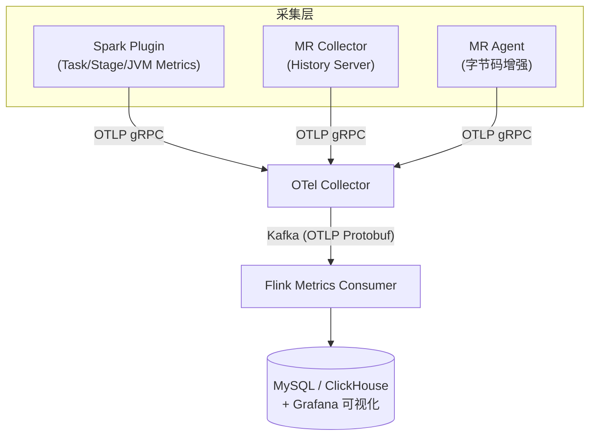

# Spark Telemetry Listener

透明的大数据可观测性方案，通过 OpenTelemetry 协议采集 Spark / MapReduce 任务指标，经 Kafka 持久化到 MySQL / ClickHouse，最终通过 Grafana 可视化。

## 系统架构



## 核心组件

| 组件 | 说明 |
|------|------|
| **Spark Telemetry Plugin** | 透明 Spark 插件，捕获任务/阶段 IO 指标及 JVM 系统指标 |
| **MR Telemetry Collector** | 独立 Java 应用，轮询 Hadoop History Server 采集 MR 作业指标 |
| **MR Telemetry Agent** | Java Agent，通过字节码增强实时采集 MR 任务级指标 |
| **Hive Telemetry Hook** | Hive 查询 Hook，捕获 HiveServer2 查询指标（支持 MR 和 Spark 引擎） |
| **Flink Metrics Consumer** | Flink 作业，消费 Kafka 中的 OTLP 指标写入 MySQL / ClickHouse |
| **Omnipackage** | 统一 JAR，自动检测 Spark 版本（2/3/4），同时包含 MR 和 Hive 组件 |

## 支持版本

| Spark 版本 | Scala | Maven Profile | 加载方式 |
|------------|-------|---------------|---------|
| Spark 2.4.x | 2.11 | `spark-2` | `spark.extraListeners` |
| Spark 3.5.x | 2.12 | `spark-3`（默认） | `SparkPlugin` API |
| Spark 4.0.x | 2.13 | `spark-4` | `SparkPlugin` API |

## 快速开始

详细的部署指南见 **[快速开始](quickstart.md)**，包含完整的构建、基础设施部署、组件配置和数据验证步骤。

### 构建

```bash
# Omnipackage（推荐，单 JAR 支持 Spark 2/3/4 + MR Agent/Collector + Hive Hook）
chmod +x build-omni.sh && ./build-omni.sh

# 或单独构建各版本
mvn clean package -DskipTests              # Spark 3.x（默认）
mvn clean package -Pspark-2 -DskipTests    # Spark 2.x
mvn clean package -Pspark-4 -DskipTests    # Spark 4.x
```

### 部署

```bash
# 安装 Omnipackage 到 Spark / Hive / MR
./deploy/install-omni.sh \
  --spark-home=/opt/spark --hive-home=/opt/hive --hadoop-home=/opt/hadoop \
  --otel-endpoint=http://otel-collector:4317 -y

# 导入 Grafana 面板
./deploy/deploy-grafana.sh \
  --grafana-url=http://grafana:3000 --user=admin --password=admin
```

## 模块结构

```
spark/spark-telemetry-common/             # 核心库：配置、模型、OTel SDK、生命周期管理
spark/spark-telemetry-adapter-spark2/     # Scala 2.11 适配层，Spark 2.4
spark/spark-telemetry-adapter-spark3/     # Scala 2.12 适配层，Spark 3.5
spark/spark-telemetry-adapter-spark30/    # Scala 2.12 适配层，Spark 3.0
spark/spark-telemetry-adapter-spark32/    # Scala 2.12 适配层，Spark 3.2
spark/spark-telemetry-adapter-spark4/     # Scala 2.13 适配层，Spark 4.0
spark/spark-telemetry-dist-spark{2,3,4}/  # 各版本 Shaded Fat JAR
spark/spark-telemetry-omni-facade/        # Omnipackage Java 门面（自动检测 Spark 版本）
spark/spark-telemetry-adapters-relocated/ # 适配器重定位（v2/v3/v4 包隔离）
spark/spark-telemetry-dist-omni/          # 统一 Shaded Fat JAR（Spark 2/3/4 + MR + Hive）
mapreduce-collector/mr-telemetry-collector/             # MR 作业指标采集器（独立 Java 应用）
mapreduce-agent/mr-telemetry-agent/                 # MR 任务级 Agent（Java Agent）
mapreduce-collector/mr-telemetry-dist/         # Shaded Fat JAR
mapreduce-agent/mr-telemetry-agent-dist/         # Shaded Fat JAR
hive/hive-telemetry-hook/                # Hive 查询 Hook（ExecuteWithHookContext）
hive/hive-telemetry-hook-dist/           # Shaded Fat JAR
flink/metrics-flink-consumer/             # Flink 消费者（Kafka → MySQL / ClickHouse）
flink/metrics-flink-consumer-dist/        # Shaded Fat JAR
integration-tests/                  # 集成测试（Spark 3）
```

## 关键特性

- **DELTA Temporality**：所有 OTLP 导出器使用 DELTA 临时性，防止重导出时数据重复
- **异步刷新**：`flushAsync()` 在 `onJobEnd` 时非阻塞刷新，避免阻塞 DAGScheduler
- **appId Fallback**：自动回退 `appId → appName → "unknown"`，兼容 local 模式
- **三层配置合并**：Spark Conf 覆盖 > HOCON 文件 > 内置默认值
- **指标分类开关**：5 个 Category 独立控制采集粒度
- **Stage 治理预聚合**：Flink Consumer 自动计算数据倾斜、CPU 效率、GC 开销等治理指标
- **Shaded Fat JAR**：OTel/gRPC/Protobuf 等依赖 relocate 到 `x.mg.metrics.shaded.*`，无依赖冲突

## 配置示例

配置文件示例见 `conf/examples/` 目录：

- `conf/examples/telemetry.conf.example` — Spark 插件配置
- `conf/examples/mr-collector.conf.example` — MR Collector 配置
- `conf/examples/flink-consumer.conf.example` — Flink Consumer 配置

## 指标概览

### Spark 指标

| 类别 | 示例指标 |
|------|---------|
| 任务 IO | `spark.task.io.bytes_read/written`, `spark.task.shuffle.bytes_read/written` |
| 任务执行 | `spark.task.executor.run_time_ms`, `spark.task.executor.cpu_time_ns` |
| 任务时长 | `spark.task.duration_ms`（Histogram） |
| Stage 详情 | `spark.stage.duration_ms`, `spark.stage.io.bytes_read/written` |
| 作业生命周期 | `spark.job.duration_ms`, `spark.job.num_stages` |
| JVM | `spark.jvm.memory.heap_used`, `spark.jvm.gc.count/time_ms` |

### MR 指标

| 来源 | 示例指标 |
|------|---------|
| MR Collector（作业级） | `mr.job.io.hdfs_bytes_read/written`, `mr.job.cpu_time_ms` |
| MR Agent（任务级） | `mr.task.io.map_input_records`, `mr.task.cpu_time_ms` |

### Hive 指标

| 类别 | 示例指标 |
|------|---------|
| 查询执行 | `hive.query.duration_ms`, `hive.query.success` / `hive.query.failure` |
| IO 指标 | `hive.query.input_bytes`, `hive.query.output_bytes`, `hive.query.input_rows`, `hive.query.output_rows` |
| 表级统计 | `hive.query.input_tables`, `hive.query.output_tables` |

## Grafana 可视化

`deploy/grafana/` 目录提供预构建仪表盘 JSON 文件，可通过 `deploy/deploy-grafana.sh` 一键导入：

| 文件 | 面板名 | 说明 |
|------|--------|------|
| `overview.json` | Platform Telemetry Overview | 全平台总览 |
| `spark.json` | Spark Telemetry | Task/Stage/SQL 指标 |
| `mr.json` | MapReduce Telemetry | Job Level + Task Level |
| `hive-mr.json` | Hive on MR Telemetry | Hive MR 引擎查询 |
| `hive-spark.json` | Hive on Spark Telemetry | Hive Spark 引擎查询 |
| `spark-mr-telemetry-dashboard.json` | Spark/MR/Hive 合并面板 | 综合视图 |

面板覆盖：任务 IO / 时长时序趋势、JVM 内存 / GC 监控、数据倾斜检测、资源效率分析、小文件检测、任务时长直方图分布。

## 完整文档

详细的部署指南、配置参数、指标参考、排查手册见 [部署指南](deployment-guide.md)。

## K8s 测试环境

`deploy/k8s/` 目录包含完整的 Kubernetes 测试环境清单（Hadoop、Spark、Kafka、OTel Collector、MySQL、ClickHouse）。

## 性能基准测试

使用 Intel HiBench 在 4C8G 单节点环境（192.168.10.65）上，对比 telemetry 组件加载前后的业务性能开销。数据规模：HiBench small profile（WordCount 320MB，SQL 100K rows，KMeans 3M samples）。每个工作负载先跑一次 baseline（无 telemetry），再跑一次 with-telemetry，验证指标到达 MySQL。

### Spark 3.2.0 + Hadoop 3.2.0

Omnipackage 通过 `spark.plugins` 加载，`spark.telemetry.otel.export.interval.ms=5000`，开启全部指标类别。

| 工作负载 | Baseline | Telemetry | 开销 | 指标到达 |
|---------|----------|-----------|------|---------|
| micro/wordcount | 14.9s | 18.5s | +24.7% | YES |
| micro/sort | 14.2s | 12.6s | -11.8% | YES |
| micro/terasort | 20.1s | 19.2s | -4.4% | YES |
| micro/repartition | 15.9s | 14.2s | -10.8% | YES |
| sql/aggregation | 22.8s | 20.2s | -11.5% | YES |
| sql/join | 24.3s | 25.2s | +3.7% | YES |
| sql/scan | 22.1s | 23.5s | +6.3% | YES |
| ml/kmeans | 29.4s | 29.4s | -0.1% | YES |
| ml/lr | 72.5s | 75.7s | +4.4% | YES |
| websearch/pagerank | 17.4s | 15.1s | -13.3% | YES |

10 个工作负载全部通过，所有指标均已验证到达 MySQL。平均开销约 -1.3%（在测量噪声范围内）。

### MR Agent + Hadoop 3.2.0

MR Agent 通过 `-javaagent` 注入到 `mapreduce.map/reduce.java.opts`。

| 工作负载 | Baseline | Telemetry | 开销 | 指标到达 |
|---------|----------|-----------|------|---------|
| micro/wordcount | 50.6s | 27.5s | -45.7% | YES |
| micro/sort | 41.3s | 25.7s | -37.8% | YES |
| micro/terasort | 45.6s | 28.2s | -38.1% | YES |

3 个工作负载全部通过。Telemetry 运行更快是因为 MR 任务数和 JVM 预热差异，非 agent 效果。所有 `mr.task.*` 指标已验证到达 MySQL。

### Hive Hook + Hadoop 3.2.0

Hive Hook 通过 `hive.exec.post.hooks` 注入。测试 Hive 3.1.3 和 2.3.9，均使用 MR 引擎。

**Hive 3.1.3**

| 工作负载 | Baseline | Telemetry | 开销 | 指标到达 |
|---------|----------|-----------|------|---------|
| sql/aggregation | 55.8s | 56.8s | +1.7% | YES |
| sql/join | 98.9s | 99.3s | +0.4% | YES |
| sql/scan | 62.4s | 62.9s | +0.8% | YES |

**Hive 2.3.9**

| 工作负载 | Baseline | Telemetry | 开销 | 指标到达 |
|---------|----------|-----------|------|---------|
| sql/aggregation | 55.7s | 52.5s | -5.7% | YES |
| sql/join | 97.2s | 97.9s | +0.7% | YES |
| sql/scan | 61.6s | 61.9s | +0.4% | YES |

12 个 Hive 运行全部成功，所有 `hive.query.*` 指标已验证到达 MySQL。Hook 开销 <2%。

### 兼容性矩阵

| 组件 | Hadoop 2.7.0 | Hadoop 3.2.0 | Spark 2.4.4 | Spark 3.2.0 | Hive 2.3.9 | Hive 3.1.3 |
|------|:---:|:---:|:---:|:---:|:---:|:---:|
| Spark Plugin (Omnipackage) | - | PASS | - | PASS | - | - |
| MR Agent | - | PASS | - | - | - | - |
| Hive Hook | - | PASS | - | - | PASS | PASS |

### 测试环境

- **硬件**: 4C8G 单节点（192.168.10.65），Java 8（`/opt/jdk8u482-b08`）
- **数据流**: Plugin/Agent/Hook → OTLP gRPC → OTel Collector → Kafka → Flink Consumer → MySQL
- **HiBench 版本**: 8.0-SNAPSHOT，`small` profile
- **Benchmark 脚本**: `benchmark/auto_bench.sh`

## License

Private
