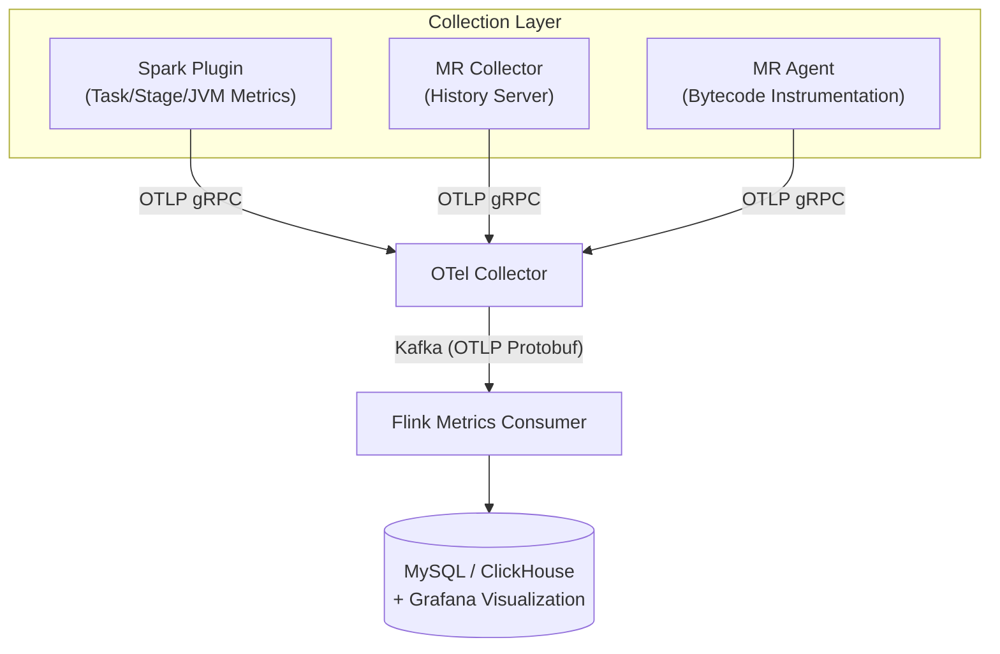

# Spark Telemetry Listener

A transparent big data observability solution that captures Spark / MapReduce task metrics via the OpenTelemetry protocol, persists them through Kafka to MySQL / ClickHouse, and visualizes them in Grafana.

## System Architecture



## Core Components

| Component | Description |
|-----------|-------------|
| **Spark Telemetry Plugin** | Transparent Spark plugin capturing task/stage IO metrics and JVM system metrics |
| **MR Telemetry Collector** | Standalone Java app polling Hadoop History Server for MR job metrics |
| **MR Telemetry Agent** | Java Agent using bytecode instrumentation for real-time MR task-level metrics |
| **Hive Telemetry Hook** | Hive query hook capturing HiveServer2 query metrics (supports MR and Spark engines) |
| **Flink Metrics Consumer** | Flink job consuming OTLP metrics from Kafka, writing to MySQL / ClickHouse |
| **Diagnostic Tool** | Interactive diagnostic tool using a state machine to check OTel Collector, Kafka, MySQL, Grafana dashboards and application configuration correctness |
| **Omnipackage** | Unified JAR that auto-detects Spark version (2/3/4), includes MR and Hive components |

## Supported Versions

| Spark Version | Scala | Maven Profile | Loading Method |
|---------------|-------|---------------|----------------|
| Spark 2.4.x | 2.11 | `spark-2` | `spark.extraListeners` |
| Spark 3.5.x | 2.12 | `spark-3` (default) | `SparkPlugin` API |
| Spark 4.0.x | 2.13 | `spark-4` | `SparkPlugin` API |

## Quick Start

For a detailed deployment guide, see **[Quick Start](quickstart.md)**, which covers end-to-end build, infrastructure deployment, component configuration, and data validation steps.

### Build

```bash
# Omnipackage (recommended, single JAR supporting Spark 2/3/4 + MR Agent/Collector + Hive Hook)
chmod +x build-omni.sh && ./build-omni.sh

# Or build individual versions
mvn clean package -DskipTests              # Spark 3.x (default)
mvn clean package -Pspark-2 -DskipTests    # Spark 2.x
mvn clean package -Pspark-4 -DskipTests    # Spark 4.x
```

### Deploy

```bash
# Install Omnipackage to Spark / Hive / MR
./deploy/install-omni.sh \
  --spark-home=/opt/spark --hive-home=/opt/hive --hadoop-home=/opt/hadoop \
  --otel-endpoint=http://otel-collector:4317 -y

# Import Grafana dashboards
./deploy/deploy-grafana.sh \
  --grafana-url=http://grafana:3000 --user=admin --password=admin
```

## Module Structure

```
spark/spark-telemetry-common/             # Core library: config, models, OTel SDK, lifecycle management
spark/spark-telemetry-adapter-spark2/     # Scala 2.11 adapter, Spark 2.4
spark/spark-telemetry-adapter-spark3/     # Scala 2.12 adapter, Spark 3.5
spark/spark-telemetry-adapter-spark30/    # Scala 2.12 adapter, Spark 3.0
spark/spark-telemetry-adapter-spark32/    # Scala 2.12 adapter, Spark 3.2
spark/spark-telemetry-adapter-spark4/     # Scala 2.13 adapter, Spark 4.0
spark/spark-telemetry-dist-spark{2,3,4}/  # Version-specific Shaded Fat JARs
spark/spark-telemetry-omni-facade/        # Omnipackage Java facade (auto-detects Spark version)
spark/spark-telemetry-adapters-relocated/ # Adapter relocation (v2/v3/v4 package isolation)
spark/spark-telemetry-dist-omni/          # Unified Shaded Fat JAR (Spark 2/3/4 + MR + Hive)
mapreduce-collector/mr-telemetry-collector/             # MR job metric collector (standalone Java app)
mapreduce-agent/mr-telemetry-agent/                 # MR task-level Agent (Java Agent)
mapreduce-collector/mr-telemetry-dist/         # Shaded Fat JAR
mapreduce-agent/mr-telemetry-agent-dist/         # Shaded Fat JAR
hive/hive-telemetry-hook/                # Hive query hook (ExecuteWithHookContext)
hive/hive-telemetry-hook-dist/           # Shaded Fat JAR
flink/metrics-flink-consumer/             # Flink consumer (Kafka -> MySQL / ClickHouse)
flink/metrics-flink-consumer-dist/        # Shaded Fat JAR
diagnostic/diagnostic-core/               # Interactive diagnostic tool (JLine CLI + 11-state auto check)
integration-tests/                  # Integration tests (Spark 3)
```

## Key Features

- **DELTA Temporality**: All OTLP exporters use DELTA temporality to prevent duplicate data on re-export
- **Async Flush**: `flushAsync()` non-blocking flush on `onJobEnd` to avoid blocking DAGScheduler
- **appId Fallback**: Automatic fallback `appId -> appName -> "unknown"`, compatible with local mode
- **Three-Tier Config Merge**: Spark Conf overrides > HOCON file > built-in defaults
- **Metric Category Switches**: 6 independent Categories controlling collection granularity (including SQL query execution metrics and query_text tracking)
- **Stage Governance Pre-aggregation**: Flink Consumer automatically computes data skew, CPU efficiency, GC overhead and other governance metrics
- **SQL Text Tracking**: Both Spark and Hive support query_text capture, auto-truncated to configured length (default 4096 chars), written to sql_query_metrics, hive_query_metrics, and metric_events tables
- **metric_events Unified Wide Table**: Cross-engine analysis wide table consolidating all Spark/MR/Hive category table data, supporting cross-engine aggregation queries by engine and event_type dimensions
- **Shaded Fat JAR**: OTel/gRPC/Protobuf dependencies relocated to `x.mg.metrics.shaded.*`, no dependency conflicts

## Configuration Examples

Configuration file examples are in the `conf/examples/` directory:

- `conf/examples/telemetry.conf.example` -- Spark plugin configuration
- `conf/examples/mr-collector.conf.example` -- MR Collector configuration
- `conf/examples/flink-consumer.conf.example` -- Flink Consumer configuration
- `conf/examples/hive-telemetry.conf.example` -- Hive Hook configuration
- `diagnostic/diagnostic-core/src/main/resources/diagnostic.conf` -- Diagnostic tool configuration

## Metrics Overview

### Spark Metrics

| Category | Example Metrics |
|----------|----------------|
| Task IO | `spark.task.io.bytes_read/written`, `spark.task.shuffle.bytes_read/written` |
| Task Execution | `spark.task.executor.run_time_ms`, `spark.task.executor.cpu_time_ns` |
| Task Duration | `spark.task.duration_ms` (Histogram) |
| Stage Details | `spark.stage.duration_ms`, `spark.stage.io.bytes_read/written` |
| Job Lifecycle | `spark.job.duration_ms`, `spark.job.num_stages` |
| JVM | `spark.jvm.memory.heap_used`, `spark.jvm.gc.count/time_ms` |

### MR Metrics

| Source | Example Metrics |
|--------|----------------|
| MR Collector (Job-level) | `mr.job.io.hdfs_bytes_read/written`, `mr.job.cpu_time_ms` |
| MR Agent (Task-level) | `mr.task.io.map_input_records`, `mr.task.cpu_time_ms` |

### Hive Metrics

| Category | Example Metrics |
|----------|----------------|
| Query Execution | `hive.query.duration_ms`, `hive.query.success` / `hive.query.failure` |
| IO Metrics | `hive.query.input_bytes`, `hive.query.output_bytes`, `hive.query.input_rows`, `hive.query.output_rows` |
| Table-level Stats | `hive.query.input_tables`, `hive.query.output_tables` |

## Grafana Visualization

The `deploy/grafana/` directory provides pre-built dashboard JSON files, importable with `deploy/deploy-grafana.sh`:

| File | Dashboard Name | Description |
|------|----------------|-------------|
| `overview.json` | Platform Telemetry Overview | Full platform overview |
| `spark.json` | Spark Telemetry | Task/Stage/SQL metrics |
| `mr.json` | MapReduce Telemetry | Job Level + Task Level |
| `hive-mr.json` | Hive on MR Telemetry | Hive MR engine queries |
| `hive-spark.json` | Hive on Spark Telemetry | Hive Spark engine queries |
| `spark-mr-telemetry-dashboard.json` | Spark/MR/Hive Combined Panel | Consolidated view |
| `hive-analysis.json` | Hive Query & Data Lineage Analysis | Operation distribution, table IO, execution engine comparison |
| `performance-analysis.json` | Performance Anomaly & Bottleneck Analysis | Stage duration, GC overhead, data skew detection |
| `efficiency.json` | Comprehensive Efficiency Score | Resource efficiency score, queue efficiency comparison |
| `reliability.json` | Reliability & Failure Analysis | Task success rate trends, failure events |
| `capacity.json` | Capacity Planning & Resource Utilization | Task concurrency, memory trends, GC frequency |
| `cost-attribution.json` | Cost Attribution & Resource Ranking | User/queue/application resource ranking |
| `io-analysis.json` | Data Throughput & IO Analysis | Cross-engine IO throughput, Shuffle analysis |

The first 6 dashboards use engine-specific category tables; the latter 7 analysis dashboards use the `metric_events` unified wide table for cross-engine aggregation queries. Coverage includes: task IO / duration time-series trends, JVM memory / GC monitoring, data skew detection, resource efficiency analysis, cost attribution, small file detection, task duration histogram distributions.

## Full Documentation

For detailed deployment guides, configuration parameters, metric references, and troubleshooting manuals, see the [Deployment Guide](deployment-guide.md).

For packaging and release processes, see the [Release Guide](release.md).

## K8s Test Environment

Testing has migrated to bare-metal nodes and no longer depends on Kubernetes. See the [Integration Tests README](../integration-tests/README.md) for details.

## Integration Tests

All integration tests run on bare-metal nodes, using Docker containers for backend services (OTel Collector, Kafka, MySQL), no K8s cluster required.

### Test Matrix

| Test Class | Verification Content | Dependencies |
|------------|---------------------|--------------|
| `InfrastructureIT` | Docker containers, OTel Collector, History Server, YARN RM reachability | Docker |
| `SparkMetricsFieldVerificationIT` | Spark task/stage/job/JVM/SQL metric field completeness | Spark |
| `HiveMetricsFieldVerificationIT` | Hive query metric field completeness | Hive |
| `MRMetricsFieldVerificationIT` | MR Collector job/task metric field completeness | Hadoop YARN |
| `HadoopClusterIT` | Hadoop/YARN service availability + MR Collector end-to-end | Hadoop YARN |
| `MRAgentIT` | MR Agent bytecode instrumentation + classpath safety + metric export | Hadoop YARN |
| `SparkMultiVersionIT` | Spark 2.4/3.0/3.2/3.5/4.0 cross-version compatibility | Multi-version Spark |
| `ApiCompatibilityIT` | Reflection-based Spark/Hadoop/Hive API compatibility verification | Build artifacts |

### Running

```bash
# Build and deploy
mvn clean package -Pspark-3 -DskipTests
cp spark/spark-telemetry-dist-spark3/target/*.jar $SPARK_HOME/jars/

# Run all IT tests
mvn verify -Pspark-3 -pl integration-tests -Dtest.skip=true

# Run a single test
mvn failsafe:integration-test -Pspark-3 -pl integration-tests -Dit.test=SparkMetricsFieldVerificationIT
```

## Performance Benchmarks

Using Intel HiBench on a 4C8G single-node environment (&lt;BENCHMARK_SERVER_IP&gt;), comparing business performance overhead before and after loading telemetry components. Data scale: HiBench small profile (WordCount 320MB, SQL 100K rows, KMeans 3M samples). Each workload runs once as baseline (no telemetry), then once with-telemetry, verifying metrics arrive in MySQL.

### Spark 3.2.0 + Hadoop 3.2.0

Omnipackage loaded via `spark.plugins`, `spark.telemetry.otel.export.interval.ms=5000`, all metric categories enabled.

| Workload | Baseline | Telemetry | Overhead | Metrics Arrived |
|----------|----------|-----------|----------|-----------------|
| micro/wordcount | 14.9s | 18.5s | +24.7% | YES |
| micro/sort | 14.2s | 12.6s | -11.8% | YES |
| micro/terasort | 20.1s | 19.2s | -4.4% | YES |
| micro/repartition | 15.9s | 14.2s | -10.8% | YES |
| sql/aggregation | 22.8s | 20.2s | -11.5% | YES |
| sql/join | 24.3s | 25.2s | +3.7% | YES |
| sql/scan | 22.1s | 23.5s | +6.3% | YES |
| ml/kmeans | 29.4s | 29.4s | -0.1% | YES |
| ml/lr | 72.5s | 75.7s | +4.4% | YES |
| websearch/pagerank | 17.4s | 15.1s | -13.3% | YES |

All 10 workloads passed, all metrics verified arriving in MySQL. Average overhead approximately -1.3% (within measurement noise).

### MR Agent + Hadoop 3.2.0

MR Agent injected via `-javaagent` in `mapreduce.map/reduce.java.opts`.

| Workload | Baseline | Telemetry | Overhead | Metrics Arrived |
|----------|----------|-----------|----------|-----------------|
| micro/wordcount | 50.6s | 27.5s | -45.7% | YES |
| micro/sort | 41.3s | 25.7s | -37.8% | YES |
| micro/terasort | 45.6s | 28.2s | -38.1% | YES |

All 3 workloads passed. Telemetry runs faster due to MR task count and JVM warmup variations, not agent effect. All `mr.task.*` metrics verified arriving in MySQL.

### Hive Hook + Hadoop 3.2.0

Hive Hook injected via `hive.exec.post.hooks`. Tested with Hive 3.1.3 and 2.3.9, both using MR engine.

**Hive 3.1.3**

| Workload | Baseline | Telemetry | Overhead | Metrics Arrived |
|----------|----------|-----------|----------|-----------------|
| sql/aggregation | 55.8s | 56.8s | +1.7% | YES |
| sql/join | 98.9s | 99.3s | +0.4% | YES |
| sql/scan | 62.4s | 62.9s | +0.8% | YES |

**Hive 2.3.9**

| Workload | Baseline | Telemetry | Overhead | Metrics Arrived |
|----------|----------|-----------|----------|-----------------|
| sql/aggregation | 55.7s | 52.5s | -5.7% | YES |
| sql/join | 97.2s | 97.9s | +0.7% | YES |
| sql/scan | 61.6s | 61.9s | +0.4% | YES |

All 12 Hive runs succeeded, all `hive.query.*` metrics verified arriving in MySQL. Hook overhead <2%.

### Compatibility Matrix

| Component | Hadoop 2.7.0 | Hadoop 3.2.0 | Spark 2.4.4 | Spark 3.2.0 | Hive 2.3.9 | Hive 3.1.3 |
|-----------|:---:|:---:|:---:|:---:|:---:|:---:|
| Spark Plugin (Omnipackage) | - | PASS | - | PASS | - | - |
| MR Agent | - | PASS | - | - | - | - |
| Hive Hook | - | PASS | - | - | PASS | PASS |

### Test Environment

- **Hardware**: 4C8G single node (&lt;BENCHMARK_SERVER_IP&gt;), Java 8 (`/opt/jdk8u482-b08`)
- **Data Flow**: Plugin/Agent/Hook -> OTLP gRPC -> OTel Collector -> Kafka -> Flink Consumer -> MySQL
- **HiBench Version**: 8.0-SNAPSHOT, `small` profile
- **Benchmark Script**: `benchmark/auto_bench.sh`

## Error Isolation Testing

Telemetry components follow the principle of **never blocking user tasks**: any telemetry initialization failure, OTel connection loss, or SDK internal exception must never affect normal execution of Spark/Hive/MR jobs.

### Defense Layers

| Layer | Location | Defense Mechanism |
|-------|----------|-------------------|
| OTel SDK Init | `OtelRegistry.start()` | On exception, sets `OpenTelemetry.noop()` to prevent cascading NPE failures in downstream MetricRecorder |
| Lifecycle Init | `TelemetryLifecycle.init()` | Catches construction exceptions, creates disabled instance that silently drops all events |
| Driver/Executor Plugin | `TelemetryDriverPlugin.init()` / `TelemetryExecutorPlugin.init()` | Wrapped in try-catch, failure only logs warning, SparkContext/Executor starts normally |
| Spark Listener | `SparkTelemetryListener` event methods | Try-catch wrapped, exceptions do not affect Spark DAGScheduler |
| Hive Hook | `HiveTelemetryHook.run()` | Top-level try-catch, exceptions do not propagate to HiveServer2 |
| MR Agent | ByteBuddy Advice | All exceptions swallowed inside `@Advice.OnMethodEnter/Exit`, does not interrupt MR Task |
| Omnipackage Facade | `SparkTelemetryPlugin` / `SparkTelemetryListener` | Returns no-op implementation on reflection loading failure, does not throw RuntimeException |
| OTel SDK Logging | `OtelRegistry.suppressOtelSdkErrorLogs()` | Downgrades shaded OTel SDK ERROR logs to WARNING to prevent false alarms when collector is unreachable |

### Verification Scenarios

| Scenario | Expected Behavior | Verification Method |
|----------|-------------------|---------------------|
| OTel Collector unreachable | Spark task completes normally, logs at WARNING level only | Submit Spark task after shutting down OTel Collector |
| OTel SDK init failure | Spark task completes normally, telemetry silently disabled | Submit Spark task with invalid endpoint configuration |
| Omnipackage version detection failure | Returns no-op plugin, Spark starts normally | Break classpath and start Spark |
| Listener reflection call failure | Event silently dropped, subsequent events unaffected | Simulate exception in listener method |
| Hive Hook exception | HiveServer2 query executes normally | Execute Hive query after throwing exception inside hook |
| MR Agent exception | MR Task completes normally | Submit MR task after internal agent exception |

### Known Logging Behavior

When the OTel Collector is unreachable, users will see the following log output (WARNING level, does not block tasks):

```
WARNING x.mg.metrics.sparktelemetry.otel.OtelRegistry: OTel Collector connection failed, metrics will not be exported: ...
```

OTel SDK internal gRPC reconnection error logs have been downgraded to WARNING and will not output at ERROR level.

## License

Private
