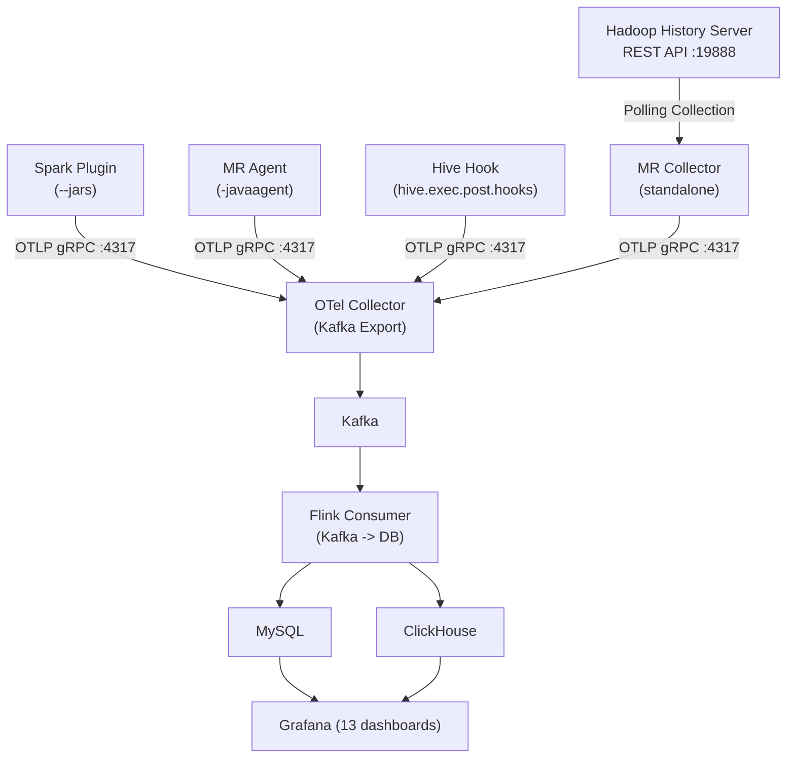

# Quick Start -- Spark / MR / Hive Telemetry Deployment Guide

## Architecture Overview



## 1. Build

```bash
# Prerequisites: JDK 8, Maven 3.6+
git clone <repo-url> && cd spark-telemetry-listener

# Build Omnipackage (single JAR supporting Spark 2/3/4 + MR Agent/Collector + Hive Hook)
chmod +x build-omni.sh && ./build-omni.sh

# Build output location
ls spark/spark-telemetry-dist-omni/target/spark-telemetry-dist-omni-*.jar

# Build individual components (optional)
mvn clean package -pl hive/hive-telemetry-hook,hive/hive-telemetry-hook-dist -am -DskipTests      # Hive Hook
mvn clean package -pl flink/metrics-flink-consumer,flink/metrics-flink-consumer-dist -am -DskipTests  # Flink Consumer
```

## 2. Infrastructure Deployment

### 2.1 OTel Collector

```yaml
# deploy/otel-collector/config.yaml
extensions:
  health_check:
    endpoint: 0.0.0.0:13133

receivers:
  otlp:
    protocols:
      grpc:
        endpoint: 0.0.0.0:4317

exporters:
  kafka:
    topic: telemetry-metrics
    encoding: otlp_proto
    brokers:
      - kafka:9092

service:
  extensions: [health_check]
  pipelines:
    metrics:
      receivers: [otlp]
      exporters: [kafka]
```

```bash
# Docker deployment
docker run -d --name otel-collector --network host \
  -v $(pwd)/deploy/otel-collector/config.yaml:/etc/otelcol-contrib/config.yaml \
  otel/opentelemetry-collector-contrib:0.96.0 \
  --config=/etc/otelcol-contrib/config.yaml
```

> **Note**: Must use `otel/opentelemetry-collector-contrib` (not the core version), as the core version does not include the Kafka exporter.

### 2.2 Kafka

```bash
# KRaft mode (no ZooKeeper required)
docker run -d --name kafka --network host \
  -e KAFKA_NODE_ID=1 \
  -e KAFKA_PROCESS_ROLES=broker,controller \
  -e KAFKA_LISTENERS=PLAINTEXT://0.0.0.0:9092,CONTROLLER://0.0.0.0:9093 \
  -e KAFKA_CONTROLLER_QUORUM_VOTERS=1@localhost:9093 \
  -e KAFKA_CONTROLLER_LISTENER_NAMES=CONTROLLER \
  -e KAFKA_ADVERTISED_LISTENERS=PLAINTEXT://$(hostname):9092 \
  apache/kafka:3.7.0

# Create topic
docker exec kafka /opt/kafka/bin/kafka-topics.sh --create \
  --topic telemetry-metrics --bootstrap-server localhost:9092 \
  --partitions 3 --replication-factor 1
```

### 2.3 MySQL / ClickHouse

```bash
# MySQL
docker run -d --name mysql --network host \
  -e MYSQL_ROOT_PASSWORD=root123 \
  -e MYSQL_DATABASE=metrics_db \
  mysql:8.0

# ClickHouse (optional)
docker run -d --name clickhouse --network host \
  clickhouse/clickhouse-server:23.8
```

### 2.4 Flink Consumer (Kafka -> DB)

A Flink DataStream API-based Kafka consumption job, using Flink KafkaSource + Checkpoint for offset management.

```bash
# Create configuration file flink-consumer.conf
# Refer to conf/flink/flink-consumer-mysql.conf or flink-consumer-clickhouse.conf

# Standalone run (no Flink cluster needed, uses Flink LocalEnvironment)
java -jar metrics-flink-consumer-dist-1.0.0-SNAPSHOT.jar /path/to/flink-consumer.conf

# Submit to Flink cluster (recommended for production)
/opt/flink-1.18.0/bin/flink run -c x.mg.metrics.flink.Main \
  -m localhost:8081 \
  /path/to/metrics-flink-consumer-dist-1.0.0-SNAPSHOT.jar /path/to/flink-consumer.conf

# Background submission (survives SSH disconnection)
nohup /opt/flink-1.18.0/bin/flink run -c x.mg.metrics.flink.Main \
  -m localhost:8081 \
  /path/to/metrics-flink-consumer-dist-1.0.0-SNAPSHOT.jar /path/to/flink-consumer.conf \
  > /tmp/flink-submit.log 2>&1 &

# Check cluster job status
curl -s http://localhost:8081/jobs | python3 -c \
  'import json,sys; [print(j["id"],j["status"]) for j in json.load(sys.stdin)["jobs"]]'

# Cancel a job
/opt/flink-1.18.0/bin/flink cancel <job-id>
```

The Flink Consumer automatically creates tables on startup (15 category tables + `metric_events` unified wide table), no manual schema initialization needed. The `metric_events` wide table consolidates data from all engines for cross-engine analysis. Kafka offsets are managed by Flink checkpoint, with `checkpoint.path` as the checkpoint storage directory.

### 2.5 Grafana

```bash
docker run -d --name grafana --network host \
  -e GF_SECURITY_ADMIN_PASSWORD=admin123 \
  grafana/grafana:latest
```

For data source configuration and dashboard import, see section 6 below.

---

## 3. Component Deployment

> All sections below use the Omnipackage single JAR (`spark-telemetry-dist-omni-*.jar`),
> which auto-detects the Spark version (2.x / 3.x / 4.x), no need to select different JARs.

### 3.1 Spark Plugin

Copy the JAR to the same path on all nodes:

```bash
scp spark-telemetry-dist-omni-*.jar node:/opt/spark-telemetry-plugin.jar
```

#### Spark 3.x / 4.x (SparkPlugin API)

```bash
spark-submit --master yarn \
  --jars /opt/spark-telemetry-plugin.jar \
  --conf spark.plugins=x.mg.metrics.sparktelemetry.adapter.SparkTelemetryPlugin \
  --conf spark.telemetry.otel.exporter.endpoint=http://otel-collector:4317 \
  --conf spark.telemetry.otel.service.name=my-spark-app \
  your-app.jar
```

#### Spark 2.x (spark.extraListeners)

```bash
spark-submit --master yarn \
  --jars /opt/spark-telemetry-plugin.jar \
  --conf spark.extraListeners=x.mg.metrics.sparktelemetry.adapter.SparkTelemetryListener \
  --conf spark.telemetry.otel.exporter.endpoint=http://otel-collector:4317 \
  --conf spark.telemetry.otel.service.name=my-spark-app \
  your-app.jar
```

#### Configuration Methods (pick one)

| Method | Example |
|--------|---------|
| Spark conf inline | `--conf spark.telemetry.otel.exporter.endpoint=http://...` |
| HOCON config file | `--conf spark.telemetry.config.path=/etc/telemetry.conf` |
| Hybrid (conf overrides file) | Use both simultaneously, Spark conf takes highest priority |

#### Preset Configurations

| Preset | Path | Description |
|--------|------|-------------|
| basic | `conf/spark{version}/basic/telemetry.conf` | Core task metrics only, minimal overhead |
| full | `conf/spark{version}/full/telemetry.conf` | All metrics (task + stage + job + SQL) |

Preset configuration directories correspond to Spark versions:

| Directory | Applicable Version |
|-----------|-------------------|
| `conf/spark24-hadoop27-hive2.3.9/` | Spark 2.4 + Hadoop 2.7 |
| `conf/spark30-hadoop3-hive2.3.9/` | Spark 3.0 + Hadoop 3 |
| `conf/spark32-hadoop3-hive2.3.9/` | Spark 3.2 + Hadoop 3 |
| `conf/spark35-hadoop3-hive2.3.9/` | Spark 3.5 + Hadoop 3 |
| `conf/spark40-hadoop3-hive2.3.9/` | Spark 4.0 + Hadoop 3 |

#### Key Configuration Items

> **YARN Mode Requirement**: When using `--master yarn`, the `HADOOP_CONF_DIR` environment variable must point to the Hadoop configuration directory (containing `core-site.xml`, `yarn-site.xml`, `mapred-site.xml`). `mapred-site.xml` must include `mapreduce.framework.name=yarn` and `mapreduce.application.classpath`, otherwise MR/Hive will fall back to local mode.

```properties
# Required
spark.telemetry.otel.exporter.endpoint=http://otel-collector:4317

# Recommended configuration
spark.telemetry.otel.service.name=my-spark-app          # Service name, used for Grafana filtering
spark.telemetry.otel.export.interval.ms=10000            # Export interval (default 10s)
spark.telemetry.config.path=/etc/telemetry.conf          # Config file path

# Metric switches (default values below)
spark.telemetry.metrics.task.execution=true              # task CPU/GC/memory/duration
spark.telemetry.metrics.task.shuffle-extended=true       # detailed shuffle metrics
spark.telemetry.metrics.task.info=true                   # task host/locality info
spark.telemetry.metrics.stage.detailed=true              # stage-level metrics
spark.telemetry.metrics.job.lifecycle=true               # job lifecycle events
spark.telemetry.metrics.sql.query-execution=true         # SQL execution metrics (join/shuffle bytes/query text)
spark.telemetry.sql.max-length=4096                      # SQL text max truncation length (characters)
```

> **Note**: conf keys must include the full path including the `.otel.` segment. Correct: `spark.telemetry.otel.exporter.endpoint`,
> Wrong: `spark.telemetry.exporter.endpoint`.

---

### 3.2 MR Agent (Task-level Real-time Metrics)

Injects into Mapper/Reducer JVMs via Java Agent, collecting task-level IO counters.

> **Prerequisite**: Ensure `mapred-site.xml` has `mapreduce.framework.name=yarn` configured, otherwise MR jobs will run in local mode and the Agent cannot be distributed via YARN.

```bash
# 1. Copy JAR to Hadoop node
scp spark-telemetry-dist-omni-*.jar node:/opt/hadoop/lib/mr-telemetry-agent.jar

# 2. Configure mapred-site.xml
```

```xml
<!-- mapred-site.xml -->
<property>
  <name>mapreduce.framework.name</name>
  <value>yarn</value>
</property>
<property>
  <name>mapreduce.map.java.opts</name>
  <value>-javaagent:/opt/hadoop/lib/mr-telemetry-agent.jar -Dmr.telemetry.agent.otel.exporter.endpoint=http://otel-collector:4317</value>
</property>
<property>
  <name>mapreduce.reduce.java.opts</name>
  <value>-javaagent:/opt/hadoop/lib/mr-telemetry-agent.jar -Dmr.telemetry.agent.otel.exporter.endpoint=http://otel-collector:4317</value>
</property>
```

MR Agent-collected metrics are written to the `mr_task_metrics` table:
- `map_input_records`, `map_output_records`, `map_output_bytes`
- `reduce_input_records`, `reduce_output_records`, `reduce_shuffle_bytes`
- `spilled_records`

---

### 3.3 MR Collector (Job-level Historical Metrics)

A standalone process that polls the Hadoop History Server REST API to collect completed MR job metrics.

```bash
# 1. Create configuration file mr-collector.conf
# Refer to conf/examples/mr-collector.conf.example or conf/spark35-hadoop3-hive2.3.9/mr-collector.conf
```

```hocon
# mr-collector.conf
mr-telemetry {
  history-server {
    url = "http://hadoop-historyserver:19888"
    poll.interval.secs = 30
  }
  otel {
    exporter.endpoint = "http://otel-collector:4317"
    service.name = "mr-telemetry-collector"
    export.interval.ms = 10000
  }
  state {
    file = "/tmp/mr-telemetry-state.json"   # Resume from checkpoint, no duplicate collection after restart
  }
  collection {
    job.counters = true      # job-level: HDFS IO, CPU, GC, maps/reduces count
    task.counters = false    # task-level (large data volume, enable on demand)
    job.details = true       # job name, user, status
  }
}
```

```bash
# 2. Run (using Omnipackage)
java -jar spark-telemetry-dist-omni-*.jar --mr-collector /path/to/mr-collector.conf

# 3. For production, use systemd or nohup for background execution
nohup java -jar spark-telemetry-dist-omni-*.jar --mr-collector /etc/mr-collector.conf &
```

MR Collector-collected metrics are written to the `mr_job_metrics` table:
- `elapsed_time_ms`, `state`, `launched_maps`, `launched_reduces`
- `hdfs_bytes_read`, `hdfs_bytes_written`, `file_bytes_read`, `file_bytes_written`
- `cpu_time_ms`, `gc_time_ms`

---

### 3.4 Hive Telemetry Hook

Captures HiveServer2 query metrics (engine-independent, supports MR and Spark engines).

```bash
# 1. Place the Omnipackage JAR in HiveServer2 auxlib (auto-loaded, no need for hive.aux.jars.path)
cp spark-telemetry-dist-omni-*.jar $HIVE_HOME/auxlib/
```

```xml
<!-- hive-site.xml -->
<property>
  <name>hive.exec.post.hooks</name>
  <value>x.mg.metrics.hivetelemetry.HiveTelemetryHook</value>
</property>
<property>
  <name>hive.telemetry.otel.exporter.endpoint</name>
  <value>http://otel-collector:4317</value>
</property>
<property>
  <name>hive.telemetry.sql.max-length</name>
  <value>4096</value>
</property>
```

Hive Hook-collected metrics are written to the `hive_query_metrics` and `hive_table_io_metrics` tables:
- `query_id`, `operation`, `user_name`, `success`, `duration_ms`
- `input_bytes`, `output_bytes`, `input_rows`, `output_rows`
- `input_tables`, `output_tables`, `execution_engine` (mr/spark)

---

## 4. Data Flow Verification

### Check if OTel Collector Received Data

```bash
docker logs otel-collector --tail=50 | grep -E "spark\.|mr\.|hive\."
```

### Check Messages in Kafka

```bash
docker exec kafka /opt/kafka/bin/kafka-dump-log.sh \
  --files /tmp/kafka-logs/telemetry-metrics-0/00000000000000000000.log
```

### Check MySQL Data

```sql
-- Spark metrics
SELECT COUNT(*) FROM task_metrics;
SELECT COUNT(*) FROM sql_query_metrics;

-- MR metrics
SELECT COUNT(*) FROM mr_job_metrics;    -- MR Collector
SELECT COUNT(*) FROM mr_task_metrics;   -- MR Agent

-- Hive metrics
SELECT COUNT(*) FROM hive_query_metrics;
SELECT COUNT(*) FROM hive_table_io_metrics;

-- Unified wide table
SELECT engine, event_type, COUNT(*) FROM metric_events GROUP BY engine, event_type;
```

### Using the Diagnostic Tool

Build and run the diagnostic tool to automatically verify all backend components and application configuration:

```bash
# Build diagnostic tool
mvn clean package -pl diagnostic/diagnostic-core -am -DskipTests

# Run (interactive CLI, JLine terminal)
java -jar diagnostic/diagnostic-core/target/diagnostic-core-1.0.0-SNAPSHOT.jar

# Specify configuration file
java -jar diagnostic/diagnostic-core/target/diagnostic-core-1.0.0-SNAPSHOT.jar \
  --config /path/to/diagnostic.conf
```

The diagnostic tool automatically performs the following checks:

| Check Item | Description |
|------------|-------------|
| Spark Plugin | JAR existence, spark.plugins configuration |
| Hive Hook | hive.exec.post.hooks configuration |
| MR Collector | Configuration file, History Server connectivity |
| OTel Collector | gRPC port connectivity, Health Check |
| Kafka | Broker connectivity, Topic existence |
| MySQL | Database connectivity, table schema validation |
| Grafana Dashboards | Dashboard SQL query validity check |
| Data Flow | End-to-end data integrity verification |

Configuration file reference: `diagnostic/diagnostic-core/src/main/resources/diagnostic.conf`

---

## 5. Grafana Dashboard Configuration

### 5.1 Add MySQL Data Source

```
URL: mysql:3306
Database: metrics_db
User: metrics / Password: metrics
```

Set data source UID to `DS_MYSQL` (dashboard SQL queries reference this UID).

### 5.2 Import Dashboards

Import the JSON files from the `deploy/grafana/` directory into Grafana:

| File | Dashboard Name | Description |
|------|----------------|-------------|
| `overview.json` | Platform Telemetry Overview | Full platform overview |
| `spark.json` | Spark Telemetry | Task/Stage/SQL metrics |
| `mr.json` | MapReduce Telemetry | Job Level + Task Level |
| `hive-mr.json` | Hive on MR Telemetry | Hive MR engine queries |
| `hive-spark.json` | Hive on Spark Telemetry | Hive Spark engine queries |
| `spark-mr-telemetry-dashboard.json` | Spark/MR/Hive Combined Panel | Consolidated view |
| `hive-analysis.json` | Hive Query & Data Lineage Analysis | Operation distribution, table IO, execution engine comparison |
| `performance-analysis.json` | Performance Anomaly & Bottleneck Analysis | Stage duration, GC overhead, data skew detection |
| `efficiency.json` | Comprehensive Efficiency Score | Resource efficiency score, queue efficiency comparison |
| `reliability.json` | Reliability & Failure Analysis | Task success rate trends, failure events |
| `capacity.json` | Capacity Planning & Resource Utilization | Task concurrency, memory trends, GC frequency |
| `cost-attribution.json` | Cost Attribution & Resource Ranking | User/queue/application resource ranking |
| `io-analysis.json` | Data Throughput & IO Analysis | Cross-engine IO throughput, Shuffle analysis |

### 5.3 MR Dashboard Description

The MR dashboard is divided into two tiers (with different data sources):

| Tier | Data Source | Collection Method | Dashboard Content |
|------|-------------|-------------------|-------------------|
| **Job Level** | `mr_job_metrics` | MR Collector (History Server) | Job count, duration, success rate, HDFS IO, CPU/GC |
| **Task Level** | `mr_task_metrics` | MR Agent (javaagent) | Map/Reduce task count, output bytes, shuffle bytes, records |

The two tiers run independently and can be deployed separately or together.

---

## 6. Frequently Asked Questions

| Problem | Cause | Solution |
|---------|-------|----------|
| `ClassNotFoundException: scala.$less$colon$less` | Old JAR in `$SPARK_HOME/jars/`, or `scala-collection-compat` falsely detecting Scala 2.13 | Delete old JARs from `$SPARK_HOME/jars/`, use the latest Omnipackage |
| `No GrpcSenderProvider found` | Shade missing OkHttp3/Kotlin dependencies | Ensure building with `build-omni.sh`, do not shade independently |
| Short jobs have no metrics | Job completes before OTel first export | Reduce `spark.telemetry.otel.export.interval.ms` (e.g., 5000) |
| `module-info.class` conflict | JDK 9+ module system conflict | `zip -d <jar> META-INF/versions/9/module-info.class` |
| SQL shuffle_bytes NULL | AQE `inputPlan` returns initial plan | Already fixed in latest version, uses reflection to access `currentPhysicalPlan` |
| Hive dashboard `Unknown column 'mr'` | Old Grafana dashboard version | Re-import `deploy/grafana/hive-mr.json` |

---

## 7. Version Compatibility

| Component | Minimum Version | Verified Versions |
|-----------|-----------------|-------------------|
| Spark | 2.4.x | 2.4.4, 3.0.x, 3.2.0, 3.5.8 |
| Hadoop | 2.7.x | 2.7.0, 3.2.0, 3.4.3 |
| Hive | 2.3.x | 2.3.9, 3.1.3 |
| Java | 8 | OpenJDK 8u482 |
| Kafka | 3.x | 3.7.0, 3.9.2 |
| Flink | 1.18 | 1.18.0 |
| OTel Collector | 0.96+ | 0.96.0 |
| MySQL | 8.0 | 8.0 |
| ClickHouse | 23.x | 23.8 |
| Grafana | 10.x | latest |
