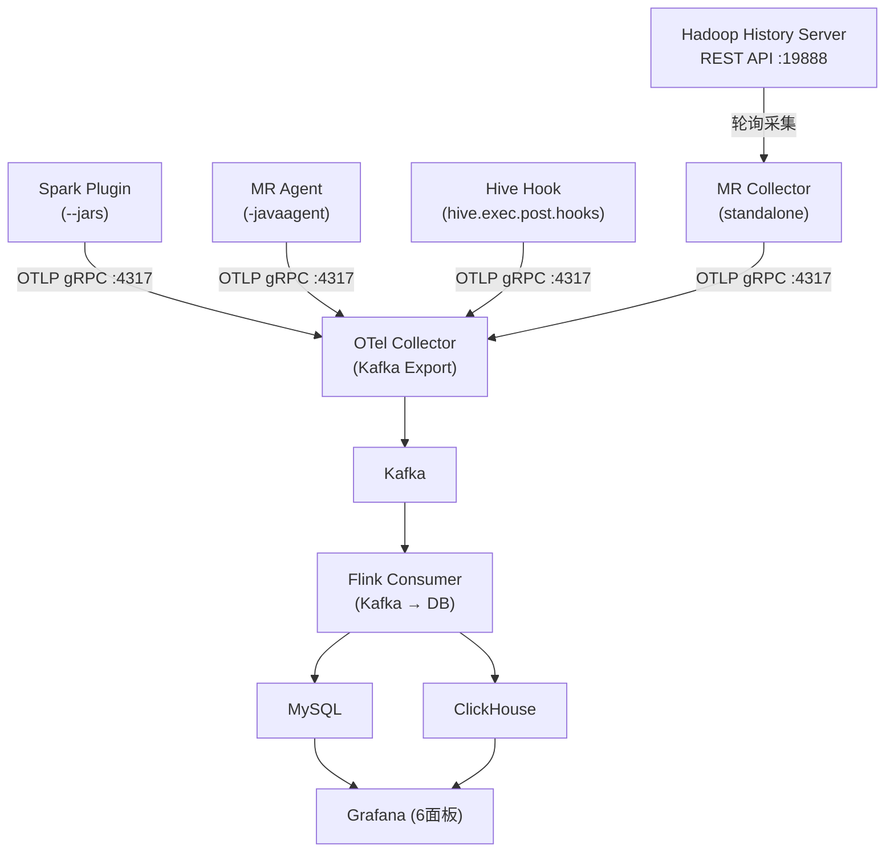

# Quick Start — Spark / MR / Hive Telemetry 部署指南

## 架构总览



## 1. 构建

```bash
# 前置：JDK 8, Maven 3.6+
git clone <repo-url> && cd spark-telemetry-listener

# 构建 Omnipackage（单 JAR 支持 Spark 2/3/4 + MR Agent/Collector + Hive Hook）
chmod +x build-omni.sh && ./build-omni.sh

# 产物位置
ls spark/spark-telemetry-dist-omni/target/spark-telemetry-dist-omni-*.jar

# 单独构建各组件（可选）
mvn clean package -pl hive/hive-telemetry-hook,hive/hive-telemetry-hook-dist -am -DskipTests      # Hive Hook
mvn clean package -pl flink/metrics-flink-consumer,flink/metrics-flink-consumer-dist -am -DskipTests  # Flink Consumer
```

## 2. 基础设施部署

### 2.1 OTel Collector

```yaml
# deploy/otel-collector/config.yaml
extensions:
  health_check:
    endpoint: 0.0.0.0:13133

receivers:
  otlp:
    protocols:
      grpc:
        endpoint: 0.0.0.0:4317

exporters:
  kafka:
    topic: telemetry-metrics
    encoding: otlp_proto
    brokers:
      - kafka:9092

service:
  extensions: [health_check]
  pipelines:
    metrics:
      receivers: [otlp]
      exporters: [kafka]
```

```bash
# Docker 部署
docker run -d --name otel-collector --network host \
  -v $(pwd)/deploy/otel-collector/config.yaml:/etc/otelcol-contrib/config.yaml \
  otel/opentelemetry-collector-contrib:0.96.0 \
  --config=/etc/otelcol-contrib/config.yaml
```

> **注意**: 必须使用 `otel/opentelemetry-collector-contrib`（非 core 版本），core 不含 Kafka exporter。

### 2.2 Kafka

```bash
# KRaft 模式（无需 ZooKeeper）
docker run -d --name kafka --network host \
  -e KAFKA_NODE_ID=1 \
  -e KAFKA_PROCESS_ROLES=broker,controller \
  -e KAFKA_LISTENERS=PLAINTEXT://0.0.0.0:9092,CONTROLLER://0.0.0.0:9093 \
  -e KAFKA_CONTROLLER_QUORUM_VOTERS=1@localhost:9093 \
  -e KAFKA_CONTROLLER_LISTENER_NAMES=CONTROLLER \
  -e KAFKA_ADVERTISED_LISTENERS=PLAINTEXT://$(hostname):9092 \
  apache/kafka:3.7.0

# 创建 topic
docker exec kafka /opt/kafka/bin/kafka-topics.sh --create \
  --topic telemetry-metrics --bootstrap-server localhost:9092 \
  --partitions 3 --replication-factor 1
```

### 2.3 MySQL / ClickHouse

```bash
# MySQL
docker run -d --name mysql --network host \
  -e MYSQL_ROOT_PASSWORD=root123 \
  -e MYSQL_DATABASE=telemetry \
  mysql:8.0

# ClickHouse（可选）
docker run -d --name clickhouse --network host \
  clickhouse/clickhouse-server:23.8
```

### 2.4 Flink Consumer（Kafka → DB）

```bash
# 创建配置文件 flink-consumer.conf
# 参考 conf/flink/flink-consumer-mysql.conf 或 flink-consumer-clickhouse.conf

# 独立运行（不需要 Flink 集群）
java -jar metrics-flink-consumer-dist-1.0.0-SNAPSHOT.jar /path/to/flink-consumer.conf

# 或通过 Flink 集群提交
flink run -c x.mg.metrics.flinkconsumer.FlinkConsumerJob \
  metrics-flink-consumer-dist-1.0.0-SNAPSHOT.jar /path/to/flink-consumer.conf
```

Flink Consumer 启动后自动建表（15 张表），无需手动初始化 schema。

### 2.5 Grafana

```bash
docker run -d --name grafana --network host \
  -e GF_SECURITY_ADMIN_PASSWORD=admin123 \
  grafana/grafana:latest
```

配置数据源和导入面板见下方 §6。

---

## 3. 组件部署

> 以下均使用 Omnipackage 单 JAR（`spark-telemetry-dist-omni-*.jar`），
> 自动检测 Spark 版本（2.x / 3.x / 4.x），无需选择不同 JAR。

### 3.1 Spark Plugin

将 JAR 分发到所有节点的相同路径：

```bash
scp spark-telemetry-dist-omni-*.jar node:/opt/spark-telemetry-plugin.jar
```

#### Spark 3.x / 4.x（SparkPlugin API）

```bash
spark-submit --master yarn \
  --jars /opt/spark-telemetry-plugin.jar \
  --conf spark.plugins=x.mg.metrics.sparktelemetry.adapter.SparkTelemetryPlugin \
  --conf spark.telemetry.otel.exporter.endpoint=http://otel-collector:4317 \
  --conf spark.telemetry.otel.service.name=my-spark-app \
  your-app.jar
```

#### Spark 2.x（spark.extraListeners）

```bash
spark-submit --master yarn \
  --jars /opt/spark-telemetry-plugin.jar \
  --conf spark.extraListeners=x.mg.metrics.sparktelemetry.adapter.SparkTelemetryListener \
  --conf spark.telemetry.otel.exporter.endpoint=http://otel-collector:4317 \
  --conf spark.telemetry.otel.service.name=my-spark-app \
  your-app.jar
```

#### 配置方式（三选一）

| 方式 | 示例 |
|------|------|
| Spark conf 内联 | `--conf spark.telemetry.otel.exporter.endpoint=http://...` |
| HOCON 配置文件 | `--conf spark.telemetry.config.path=/etc/telemetry.conf` |
| 混合（conf 覆盖文件） | 同时使用，Spark conf 优先级最高 |

#### 预设配置

| 预设 | 路径 | 说明 |
|------|------|------|
| basic | `conf/spark{version}/basic/telemetry.conf` | 仅 task 核心指标，开销最小 |
| full | `conf/spark{version}/full/telemetry.conf` | 全部指标（task + stage + job + SQL） |

预设配置目录对应 Spark 版本：

| 目录 | 适用版本 |
|------|---------|
| `conf/spark24-hadoop27-hive2.3.9/` | Spark 2.4 + Hadoop 2.7 |
| `conf/spark30-hadoop3-hive2.3.9/` | Spark 3.0 + Hadoop 3 |
| `conf/spark32-hadoop3-hive2.3.9/` | Spark 3.2 + Hadoop 3 |
| `conf/spark35-hadoop3-hive2.3.9/` | Spark 3.5 + Hadoop 3 |
| `conf/spark40-hadoop3-hive2.3.9/` | Spark 4.0 + Hadoop 3 |

#### 关键配置项

```properties
# 必填
spark.telemetry.otel.exporter.endpoint=http://otel-collector:4317

# 推荐配置
spark.telemetry.otel.service.name=my-spark-app          # 服务名，Grafana 过滤用
spark.telemetry.otel.export.interval.ms=10000            # 导出间隔（默认30s）
spark.telemetry.config.path=/etc/telemetry.conf          # 配置文件路径

# 指标开关（默认值如下）
spark.telemetry.metrics.task.execution=true              # task CPU/GC/内存/耗时
spark.telemetry.metrics.task.shuffle-extended=true       # shuffle 详细指标
spark.telemetry.metrics.task.info=true                   # task host/locality 信息
spark.telemetry.metrics.stage.detailed=false             # stage 级指标（按需开启）
spark.telemetry.metrics.job.lifecycle=false              # job 生命周期事件
spark.telemetry.metrics.sql.query-execution=true         # SQL 执行指标（join/shuffle bytes）
```

> **注意**: conf key 必须包含完整路径含 `.otel.` 段。正确：`spark.telemetry.otel.exporter.endpoint`，
> 错误：`spark.telemetry.exporter.endpoint`。

---

### 3.2 MR Agent（Task 级别实时指标）

通过 Java Agent 注入 Mapper/Reducer JVM，采集 task 级别 IO 计数器。

```bash
# 1. 将 JAR 放到 Hadoop 节点
scp spark-telemetry-dist-omni-*.jar node:/opt/hadoop/lib/mr-telemetry-agent.jar

# 2. 配置 mapred-site.xml
```

```xml
<!-- mapred-site.xml -->
<property>
  <name>mapreduce.framework.name</name>
  <value>yarn</value>
</property>
<property>
  <name>mapreduce.map.java.opts</name>
  <value>-javaagent:/opt/hadoop/lib/mr-telemetry-agent.jar -Dmr.telemetry.agent.otel.exporter.endpoint=http://otel-collector:4317</value>
</property>
<property>
  <name>mapreduce.reduce.java.opts</name>
  <value>-javaagent:/opt/hadoop/lib/mr-telemetry-agent.jar -Dmr.telemetry.agent.otel.exporter.endpoint=http://otel-collector:4317</value>
</property>
```

MR Agent 采集的指标写入 `mr_task_metrics` 表：
- `map_input_records`, `map_output_records`, `map_output_bytes`
- `reduce_input_records`, `reduce_output_records`, `reduce_shuffle_bytes`
- `spilled_records`

---

### 3.3 MR Collector（Job 级别历史指标）

独立进程，轮询 Hadoop History Server REST API，采集已完成的 MR job 指标。

```bash
# 1. 创建配置文件 mr-collector.conf
# 参考 conf/examples/mr-collector.conf.example 或 conf/spark35-hadoop3-hive2.3.9/mr-collector.conf
```

```hocon
# mr-collector.conf
mr-telemetry {
  history-server {
    url = "http://hadoop-historyserver:19888"
    poll.interval.secs = 30
  }
  otel {
    exporter.endpoint = "http://otel-collector:4317"
    service.name = "mr-telemetry-collector"
    export.interval.ms = 10000
  }
  state {
    file = "/tmp/mr-telemetry-state.json"   # 断点续传，重启后不重复采集
  }
  collection {
    job.counters = true      # job 级别：HDFS IO, CPU, GC, maps/reduces 数
    task.counters = false    # task 级别（数据量大，按需开启）
    job.details = true       # job 名称、用户、状态
  }
}
```

```bash
# 2. 运行（使用 Omnipackage）
java -jar spark-telemetry-dist-omni-*.jar --mr-collector /path/to/mr-collector.conf

# 3. 生产环境建议用 systemd 或 nohup 后台运行
nohup java -jar spark-telemetry-dist-omni-*.jar --mr-collector /etc/mr-collector.conf &
```

MR Collector 采集的指标写入 `mr_job_metrics` 表：
- `elapsed_time_ms`, `state`, `launched_maps`, `launched_reduces`
- `hdfs_bytes_read`, `hdfs_bytes_written`, `file_bytes_read`, `file_bytes_written`
- `cpu_time_ms`, `gc_time_ms`

---

### 3.4 Hive Telemetry Hook

采集 HiveServer2 查询指标（执行引擎无关，支持 MR 和 Spark 引擎）。

```bash
# 1. 将 JAR 放到 HiveServer2 auxlib
cp hive-telemetry-hook-dist-*.jar $HIVE_HOME/lib/

# 或使用 Omnipackage
cp spark-telemetry-dist-omni-*.jar $HIVE_HOME/lib/
```

```xml
<!-- hive-site.xml -->
<property>
  <name>hive.exec.post.hooks</name>
  <value>x.mg.metrics.hivetelemetry.HiveTelemetryHook</value>
</property>
<property>
  <name>hive.telemetry.otel.exporter.endpoint</name>
  <value>http://otel-collector:4317</value>
</property>
```

Hive Hook 采集的指标写入 `hive_query_metrics` 和 `hive_table_io_metrics` 表：
- `query_id`, `operation`, `user_name`, `success`, `duration_ms`
- `input_bytes`, `output_bytes`, `input_rows`, `output_rows`
- `input_tables`, `output_tables`, `execution_engine`（mr/spark）

---

## 4. 数据流验证

### 检查 OTel Collector 是否收到数据

```bash
docker logs otel-collector --tail=50 | grep -E "spark\.|mr\.|hive\."
```

### 检查 Kafka 中的消息

```bash
docker exec kafka /opt/kafka/bin/kafka-dump-log.sh \
  --files /tmp/kafka-logs/telemetry-metrics-0/00000000000000000000.log
```

### 检查 MySQL 数据

```sql
-- Spark 指标
SELECT COUNT(*) FROM task_metrics;
SELECT COUNT(*) FROM sql_query_metrics;

-- MR 指标
SELECT COUNT(*) FROM mr_job_metrics;    -- MR Collector
SELECT COUNT(*) FROM mr_task_metrics;   -- MR Agent

-- Hive 指标
SELECT COUNT(*) FROM hive_query_metrics;
SELECT COUNT(*) FROM hive_table_io_metrics;
```

---

## 5. Grafana 面板配置

### 5.1 添加 MySQL 数据源

```
URL: mysql:3306
Database: telemetry
User: metrics / Password: metrics
```

数据源 UID 设为 `DS_MYSQL`（面板 SQL 引用此 UID）。

### 5.2 导入面板

将 `deploy/grafana/` 目录下的 JSON 文件导入 Grafana：

| 文件 | 面板名 | 说明 |
|------|--------|------|
| `overview.json` | Platform Telemetry Overview | 全平台总览 |
| `spark.json` | Spark Telemetry | Task/Stage/SQL 指标 |
| `mr.json` | MapReduce Telemetry | Job Level + Task Level |
| `hive-mr.json` | Hive on MR Telemetry | Hive MR 引擎查询 |
| `hive-spark.json` | Hive on Spark Telemetry | Hive Spark 引擎查询 |
| `spark-mr-telemetry-dashboard.json` | Spark/MR/Hive 合并面板 | 综合视图 |

### 5.3 MR Dashboard 说明

MR 面板分为两个层级（数据来源不同）：

| 层级 | 数据来源 | 采集方式 | 面板内容 |
|------|---------|---------|---------|
| **Job Level** | `mr_job_metrics` | MR Collector (History Server) | Job 数量、耗时、成功率、HDFS IO、CPU/GC |
| **Task Level** | `mr_task_metrics` | MR Agent (javaagent) | Map/Reduce task 数、output bytes、shuffle bytes、records |

两个层级独立运行，可单独或同时部署。

---

## 6. 常见问题

| 问题 | 原因 | 解决 |
|------|------|------|
| `ClassNotFoundException: scala.$less$colon$less` | 旧版 JAR 在 `$SPARK_HOME/jars/`，或 `scala-collection-compat` 误判 Scala 2.13 | 删除 `$SPARK_HOME/jars/` 下的旧 JAR，使用最新 Omnipackage |
| `No GrpcSenderProvider found` | Shade 缺少 OkHttp3/Kotlin 依赖 | 确保使用 `build-omni.sh` 构建，不要单独 shade |
| 短 job 无指标 | job 在 OTel 首次 export 前结束 | 减小 `spark.telemetry.otel.export.interval.ms`（如 5000） |
| `module-info.class` 冲突 | JDK 9+ 模块系统冲突 | `zip -d <jar> META-INF/versions/9/module-info.class` |
| SQL shuffle_bytes 为 NULL | AQE `inputPlan` 返回初始计划 | 已在最新版本修复，使用反射访问 `currentPhysicalPlan` |
| Hive 面板 `Unknown column 'mr'` | Grafana 面板旧版本 | 重新导入 `deploy/grafana/hive-mr.json` |

---

## 7. 版本兼容性

| 组件 | 最低版本 | 已验证版本 |
|------|---------|-----------|
| Spark | 2.4.x | 2.4.4, 3.0.x, 3.2.0, 3.5.8 |
| Hadoop | 2.7.x | 2.7.0, 3.2.0, 3.4.3 |
| Hive | 2.3.x | 2.3.9, 3.1.3 |
| Java | 8 | OpenJDK 8u482 |
| Kafka | 3.x | 3.7.0, 3.9.2 |
| Flink | 1.18 | 1.18.0 |
| OTel Collector | 0.96+ | 0.96.0 |
| MySQL | 8.0 | 8.0 |
| ClickHouse | 23.x | 23.8 |
| Grafana | 10.x | latest |
